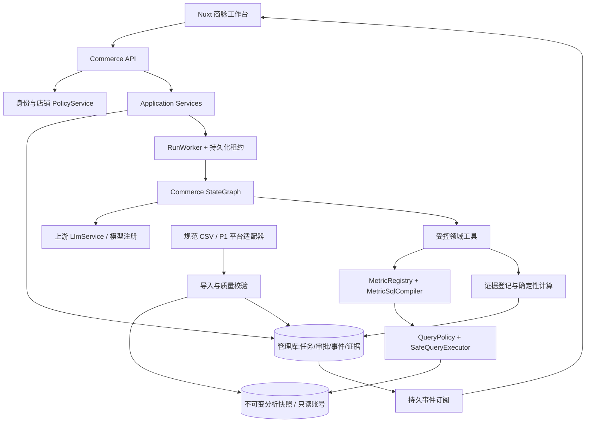
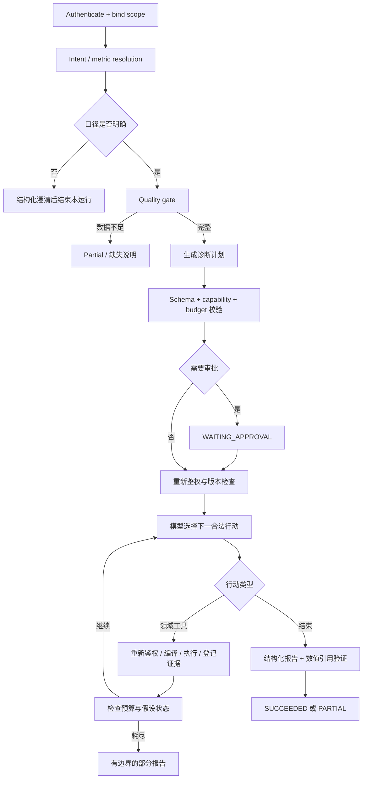

# 商脉 CommerceLens · 完整开发规格

设计基线 v1.0 · 2026-09-21

> 18份专项文档与配套设计、开发、原型及验收说明合编。目标方案与实际实现边界见交付说明。上游源码核验未锁定提交SHA，开工必须重新固定版本。

## 目录

1. 商脉 CommerceLens · 电商经营分析与异常诊断 Data Agent（`README.md`）
2. 01 · 产品需求文档 PRD（`docs/01-PRD.md`）
3. 02 · 上游核验与二次开发映射（`docs/02-UPSTREAM-ANALYSIS.md`）
4. 03 · 领域模型与指标口径（`docs/03-DOMAIN-AND-METRICS.md`）
5. 04 · 系统架构设计（`docs/04-ARCHITECTURE.md`）
6. 05 · 数据库与领域对象（`docs/05-DATA-MODEL.md`）
7. 06 · Agent 编排、工具与证据驱动诊断（`docs/06-AGENT-DESIGN.md`）
8. 07 · 查询安全、身份与权限设计（`docs/07-SECURITY.md`）
9. 08 · 接口与事件规格（`docs/08-API-SPEC.md`）
10. 09 · 前端信息架构与交互规格（`docs/09-FRONTEND-SPEC.md`）
11. 10 · 异常检测与诊断方法（`docs/10-ANOMALY-DIAGNOSIS.md`）
12. 11 · 数据接入、质量与更新（`docs/11-INGESTION.md`）
13. 12 · 测试、评测与可复现性（`docs/12-TEST-AND-EVAL.md`）
14. 13 · 部署、运维与可观测（`docs/13-DEPLOYMENT-OBSERVABILITY.md`）
15. 14 · 分阶段实施计划（`docs/14-IMPLEMENTATION-PLAN.md`）
16. 15 · 验收追踪矩阵（`docs/15-ACCEPTANCE-TRACEABILITY.md`）
17. 16 · 架构决策、权衡与风险（`docs/16-ADRS-RISKS.md`）
18. 17 · 演示脚本与工程亮点（`docs/17-DEMO-AND-ENGINEERING-VALUE.md`）
19. 18 · 上游与来源记录（`docs/18-SOURCES.md`）
20. 商脉 CommerceLens · Design System v1.0（`design.md`）
21. 开工交接 · 给编码 Agent（`CODEX-HANDOFF.md`）
22. 商脉 · 可交互前端原型（`prototype/README.md`）
23. 实际验证记录 · 2026-09-21（`evaluation/VALIDATION-REPORT.md`）


---

来源文件：`README.md`

# 商脉 CommerceLens · 电商经营分析与异常诊断 Data Agent

**交付版本：设计基线 v1.0 · 2026-09-21**  
基于 `spring-ai-alibaba/DataAgent` 的领域化二次开发方案。面向多店铺运营团队，让每一个经营结论都能回到指标口径、查询结果和数据版本。

> 本包交付的是完整开发规格、契约与数据资产、离线交互原型；不是已经接入电商平台的生产系统。原型中的企业、店铺、订单、异常和运行记录均为合成演示数据。未经实测的性能与评测数字均为验收目标，不是已达成成果。

## 从哪里开始

| 目的 | 文件 |
|---|---|
| 完整文档阅读 | `handbook.html` / `CommerceLens_Complete_Specification.md` |
| 快速体验产品 | `prototype/index.html`，直接用浏览器打开，无外部 CDN |
| 交给 Codex 开发 | `CODEX-HANDOFF.md` → `docs/02-UPSTREAM-ANALYSIS.md` → `docs/14-IMPLEMENTATION-PLAN.md` |
| 阅读完整需求 | `docs/01-PRD.md` |
| 理解业务与口径 | `docs/03-DOMAIN-AND-METRICS.md`、`contracts/metrics.json` |
| 理解架构与 Agent | `docs/04-ARCHITECTURE.md`、`docs/06-AGENT-DESIGN.md` |
| 接口与数据库 | `contracts/openapi.yaml`、`database/` |
| 前端设计与接入 | `design.md`、`docs/09-FRONTEND-SPEC.md`、`frontend-reference/` |
| 验收与复现实验 | `evaluation/`、`docs/12-TEST-AND-EVAL.md` |
| 查看上游取证 | `docs/18-SOURCES.md`、`upstream-baseline.json` |

## 已固定的产品边界

首版 8 张业务表：店铺、商品、订单、订单明细、成功支付、成功退款、店铺日流量、商品日库存。8 个核心指标：支付 GMV、支付订单数、客单价、成功退款额、净收款额、退款金额强度、访客会话数、支付订单转化比。

首版支持一个租户多个店铺、单一 MySQL 分析方言、人民币、Asia/Shanghai 业务日、只读经营分析、可审批的诊断计划、证据与报告。**不做自动调价、退款、投放、补货；不做预测；不把净收款写成利润；不开放任意 SQL/Python；没有订单项退款映射时拒绝 SKU 退款分析。** 平台自身的任务/审批/规则元数据允许写入管理库，不属于经营数据写操作。

## 文件结构

- `docs/`：产品、业务、架构、安全、数据、Agent、前端、运维、实施、验收等专项文档。
- `contracts/`：OpenAPI、查询/报告 JSON Schema、指标目录。
- `database/`：业务库和管理扩展库的 MySQL 建表草案、示例查询、CSV 导入说明。
- `fixtures/`：可复现的合成数据、原型数据、金标准期望结果。
- `prototype/`：离线可交互 HTML/CSS/JavaScript 原型，提供拆分源文件和单文件入口。
- `frontend-reference/`：Nuxt 集成位置与类型化 API 边界参考，不声称已完成上游前端合并构建。
- `evaluation/`：边界用例、固定问答集、数据校验和原型浏览器测试。
- `prompts/`：领域规划与证据报告提示词，以及开工交接提示词。
- `previews/`：从实际原型页面截取的页面预览。

## 原型运行

直接打开 `prototype/index.html` 即可。也可在本目录运行 `python -m http.server 8080`，访问 `http://localhost:8080/prototype/`。后者仅是静态文件服务，没有后端鉴权或真正的模型调用。原型页面始终显示“演示数据”。

## 验证与限制

本包的验证详情以 `evaluation/VALIDATION-REPORT.md` 为准。MySQL DDL、Java 改造建议及 Nuxt 接入参考需要在开发环境执行集成测试；本次未在容器中拉取、编译或运行上游完整仓库。上游网页核验基于读取时的 `main`，未获得不可变提交 SHA，开工第一步必须固定并复核版本。禁止把本包描述为生产已上线或安全审计通过。


---

来源文件：`docs/01-PRD.md`

# 01 · 产品需求文档 PRD

版本 v1.0；状态：可进入技术评审的目标设计。所有“必须”是交付验收要求，不是上游已存在的能力。

## 1. 定位与目标

**商脉 CommerceLens** 是面向品牌商与多店铺运营团队的可信经营分析与异常诊断工作台。它回答三个连续问题：发生了什么、哪些分组/因素贡献了变化、还需要什么证据才能采取行动。

区别于通用问数工具，本项目把分析限定在已治理的指标和授权数据上，并把诊断过程变成可审查的步骤与证据链。产品不能承诺找到所有“根因”，必须允许输出“证据不足”“只能做描述性解释”。

项目技术目标是形成可验证的 Java 领域建模、受控查询编译、Agent 动态诊断、任务恢复和评测能力，而不是只换一套电商 Prompt。

## 2. 用户与权限

| 角色 | 主要行为 | 数据范围 |
|---|---|---|
| 租户管理员 | 管理成员、授权店铺、导入数据、发布指标/规则 | 本租户被授予管理权限的数据 |
| 运营经理 | 跨授权店铺总览、发起诊断、审批本人的高成本计划、查看团队共享报告 | 显式授权店铺的全集或子集 |
| 店铺运营 | 单店分析、查看自己/团队可见报告 | 显式授权的店铺 |
| 只读观察者 | 查看已共享报告与基础总览 | 报告声明范围与当前授权的交集必须覆盖整份报告 |

首版报告仅提供私有与租户团队共享，不做公网匿名分享。团队可见不等于有权查看其中所有店铺。权限验证覆盖报告、证据、运行事件、SQL 展示、缓存、文件导出与检索。

## 3. 核心场景

### US-01 经营总览

运营经理进入系统，默认查看最近一个数据完整业务日，展示支付 GMV、净收款、支付订单数、退款额及趋势。每个指标显示统计区间、对比区间、版本和数据更新时间。切换店铺后，卡片、趋势、表格和异常摘要同时更新，不只更换标签。支持日/7 日区间；7 日比率必须先聚合分子分母再计算。

### US-02 自然语言经营问数

用户输入“昨天销售额为什么下降”。系统首先将“销售额”明确为支付 GMV，并显示实际日期、店铺范围和对比规则。当存在多个合理口径时返回澄清表单，不猜测净收款或利润。单指标查询可免人工审批；诊断默认展示计划并审批后执行。

### US-03 异常诊断

从异常卡片发起诊断。系统选择指标、检查数据完整性、做总体与分组对比，再按返回的证据决定是否深入店铺、SKU、流量、库存或退款。失败的假设必须记录为被否定/证据不足。用户可看到执行摘要与工具结果，而不是模型隐藏思维。

### US-04 证据复核

点击“E-001”，看到口径、查询范围、参数化 SQL、去敏参数、数据集版本、结果表、执行时间和结论引用位置。未被证据支持的推断标记“待验证”。历史证据读取时重新校验当前授权，不能利用旧链接越权。

### US-05 报告与复盘

报告包含摘要、变化量、分组贡献、支持/反对证据、数据局限和建议核查动作。仅导出结构化结果生成的 Markdown 或安全 HTML，不渲染模型任意脚本。首版建议只是建议，不自动操作店铺。

### US-06 监控规则

管理员选择已发布指标、店铺、周期、绝对阈值和相对阈值，规则在完整快照上运行。数据缺失先发数据质量通知，不把缺失当成销售归零。告警经去重、冷却和恢复逻辑产生；点击进入原范围的诊断运行。

## 4. 功能范围与优先级

| ID | 能力 | 优先级 | 关键验收 |
|---|---|---|---|
| FR-01 | 租户/店铺授权上下文 | P0 | 任意越权入口均返回拒绝且不查询经营数据 |
| FR-02 | 8 指标语义目录 | P0 | UI、问数、规则共用同一版本定义 |
| FR-03 | 经营总览和分组对比 | P0 | 数值可与固定 SQL/fixture 对账 |
| FR-04 | 受控自然语言问数 | P0 | 不支持的维度必须澄清/拒绝 |
| FR-05 | 动态诊断与预算控制 | P0 | 工具返回不同证据时下一步可以不同 |
| FR-06 | 计划审批与取消 | P0 | 旧计划版本不能被批准执行 |
| FR-07 | 证据与报告 | P0 | 数值结论的引用覆盖率目标 100% |
| FR-08 | 事件重连与任务恢复 | P0 | 浏览器断开不取消；重启按幂等语义恢复 |
| FR-09 | 标准 CSV 导入与质量检查 | P0 | 未完整发布的数据不能用于正常监控 |
| FR-10 | 异常规则、去重与恢复 | P0 | 相同规则/版本/窗口/范围不重复建告警 |
| FR-11 | 运行观测与固定集评测 | P0 | 记录工具、延迟、Token、失败原因、版本 |
| FR-12 | 电商平台真实授权 API | P1 | 按平台授权条件另行接入，不在本次默认交付范围 |
| FR-13 | 精细退款归因/渠道归因 | P1 | 必须先增加相应事实数据，不凭模型补字段 |

## 5. 明确不做

不做通用 BI 编辑器、任意数据库方言、预测、自动交易/退款/调价/补货、任意用户 SQL、任意 Python 执行、跨币种财务折算、利润/毛利估算、缺失数据条件下的 SKU 退款率、无实验依据的因果结论。

## 6. 关键业务约定

业务时区 Asia/Shanghai；时间范围为左闭右开。默认“昨天”由服务端业务时区计算，而不是浏览器所在时区。金额用整数分存储，API 返回十进制字符串；时间戳用带时区 ISO 8601，日期用 `YYYY-MM-DD`。成功支付与成功退款按各自实际发生时间统计。

首版以已发布不可变数据集快照工作，数据水位不是实时承诺。界面同时展示“业务覆盖到”和“导入完成于”，不能用导入时间掩盖旧业务数据。

## 7. 非功能验收目标

基准环境定义为 4 vCPU / 8 GiB API 实例、独立 MySQL 8.4、固定 100 万订单压测集。目标：缓存总览 P95 ≤ 1s；标准聚合查询 P95 ≤ 3s；首条运行事件 ≤ 2s（不等于模型首 Token）；诊断默认预算 12 次工具调用、30,000 总 Token、180s 活跃执行时间。等待用户审批不计入活跃执行时间，审批 24h 过期。实际报告必须写明硬件、样本、模型和失败率，不把目标当已验证性能。

任何越权泄露、无证据数字、写经营库、数据缺失误报均阻止验收。异常诊断准确性不能只按语言流畅程度评分。

## 8. 交付完成条件

能从标准数据导入、完整性校验、指标查询、异常生成、审批执行、证据复核到报告导出走通真实端到端闭环；所有 P0 安全与数字回归测试通过；原型替换真实 API 后无静默 Mock 降级；源码清楚标注上游继承与二开模块。


---

来源文件：`docs/02-UPSTREAM-ANALYSIS.md`

# 02 · 上游核验与二次开发映射

核验日期 2026-09-21。以下“已观察”是上游文档或选定源码的事实；“拟新增”是本项目的设计。未执行全仓库编译、依赖漏洞扫描或完整安全审计。来源编号见 `18-SOURCES.md`。

## 1. 技术与入口基线

上游采用 `data-agent-management` 与 `data-agent-frontend-nuxt` 两个主要工程目录。根 POM 声明 Java 17、Spring Boot 3.4.8、Spring AI 1.1.2、Spring AI Alibaba 1.1.2.2；前端声明 Nuxt ^4.3.0、Vue ^3.5.27、Vuetify ^3.11.8、ECharts ^6.0.0。[S01-S03] 这些是读取时声明，不是锁文件解析结果，也不是新项目必须升级到的版本。

保留上游版本组合，在 Gate 0 固定 SHA、依赖锁和基线测试；不要为了二开随意升级框架。本文无法给出可靠的当前提交 SHA，`upstream-baseline.json` 中明确留空。

## 2. 已核查的实际扩展位置

下表后端路径均相对 `data-agent-management/src/main/java/com/alibaba/cloud/ai/dataagent/`。

| 路径 | 已观察用途 | 二开方式 |
|---|---|---|
| `config/DataAgentConfiguration.java` | 注册 StateGraph、节点、边和 checkpoint 配置 | 新增独立 Commerce 图，不原地混入所有电商逻辑；显式 Qualifier 解决多图 Bean 歧义 |
| `service/graph/GraphServiceImpl.java` | 图执行、流上下文、人工计划恢复、结束清理 | 参考其接入方式，新增持久化 RunService/RunWorker，不能直接复用流订阅生命周期 |
| `controller/GraphController.java` | `GET /api/stream/search`、`POST /api/stream/stop` | 新增 `/api/commerce/v1` 任务型 API；旧入口关闭或统一授权 |
| `workflow/node/SqlExecuteNode.java` | 取生成 SQL，构造 DbQueryParameter，调用数据访问 | Commerce 路径替换为指标编译+安全只读执行器，不允许直接传入生成 SQL |
| `workflow/node/*` | 规划、SQL、语义检查、报告等节点集合 | 复用框架与模型服务；新增领域节点与严格结果 Schema |
| `src/main/resources/sql/schema.sql`（相对模块） | 上游管理表 | 只做有版本的新增迁移，不修改上游初始化脚本来代替迁移 |
| `data-agent-frontend-nuxt/package.json`（相对根） | Nuxt/Vue/Vuetify/ECharts 依赖 | 沿用原技术栈，新增经营路由及专用组件 |

这些源码路径由 [S04-S07] 核验；拟新增的 `commerce` 类名不存在于本次核验的上游事实集合中。

## 3. 可以复用与必须新建的边界

上游文档描述模型注册、业务/智能体知识检索、工作流、人工反馈与报告功能。[S08-S10] 复用这些基础设施不意味着上游已具备电商指标计算、店铺行级隔离或证据充分性验证。

| 能力 | 处理决策 |
|---|---|
| StateGraph、模型接入、基础观测 | 复用，并增加运行版本与领域字段 |
| 业务术语/知识检索 | 复用检索接口；仅召回当前租户/已授权范围知识 |
| Prompt 化语义知识 | 保留作解释；另建机器可执行指标目录，不能以 Prompt 代替口径执行器 |
| 通用 Text-to-SQL | 电商标准路径不执行其任意 SQL；可作为封闭管理员实验，默认关闭 |
| SQL 执行节点 | 新建 `SafeQueryExecutor` + `MetricSqlCompiler`，边界位于真实数据访问前 |
| 人工计划 | 参考上游机制，新增 `planVersion`、planHash、授权/快照绑定及审批 CAS |
| HTML 报告 | 改为 JSON 结构化报告+可信组件渲染，禁止任意 HTML/JS |
| Python 沙盒/MCP | 首版关闭经营用户入口，避免绕过领域工具策略 |

## 4. 任务恢复的关键差异

源码显示 GraphController 的订阅取消会触发停止；GraphServiceImpl 的停止路径会清理上下文并释放 checkpoint。[S04-S05] 因而“框架有 checkpoint”不能直接推导出“浏览器刷新后原任务可继续”。

新版采用持久化运行状态、独立 Worker、事件日志和独立 SSE 订阅。断开连接只删除订阅，不调用任务取消；只有显式取消才停止运行。checkpoint 与业务结果分开存储，租约和 fencing token 防止多 Worker 同时提交。

## 5. 持久化 checkpoint 已存在，但不是全部答案

上游配置可选择 MysqlSaver 或 MemorySaver，并配置人工反馈中断点。[S06] 新图应复用经过验证的 saver 接入方式，同时建立自己的运行状态和工具结果幂等存储。不要把“新增 MySQL checkpoint”包装为本项目原创，也不要认为换成 MySQL 就解决了授权撤回、重复执行、事件重放和审批并发。

## 6. 建议新增包与集成规则

```text
commerce/
  api/                  # 只接受领域 DTO 的 HTTP 接入
  application/          # RunService / OverviewService / ReportService
  domain/metric/        # MetricDefinition / QuerySpec / MetricRegistry
  domain/security/      # ScopeContext / PolicyDecision
  domain/diagnosis/     # Hypothesis / Evidence / DiagnosticReport
  infrastructure/query/# MetricSqlCompiler / SafeQueryExecutor
  infrastructure/run/  # RunRepository / RunLease / EventStore
  workflow/             # CommerceGraphConfiguration 与领域节点
  ingestion/            # CSV staging / 校验 / 快照发布
```

为既有单图 Bean 补充限定名/条件，确保通用图与 Commerce 图不会因 `StateGraph`、`CompileConfig`、`BaseCheckpointSaver` 按类型注入产生冲突。先写上下文启动测试验证，再扩展功能。

## 7. 必须补查的事项

Gate 0 核查实际认证拦截器、MCP/API Key 权限、各数据库访问链路、前端 `app/` 目录、pnpm lock、模型与向量库初始化依赖、所有可执行入口以及全量取消/异常流程。本文没有因未看到安全检查就断言上游没有安全机制；生产边界必须以实际调用链和对抗测试为准。

保留 Apache-2.0 相关许可和上游版权声明，明确新增模块与改动。第三方依赖许可证与发布要求由交付者在发布前核查。[S01]


---

来源文件：`docs/03-DOMAIN-AND-METRICS.md`

# 03 · 领域模型与指标口径

## 1. 时间、金额与事实边界

所有业务日按 `Asia/Shanghai` 定义；查询内部将日边界转换为 UTC 时间戳，使用 `[start,end)`。不能用浏览器本地时区，也不能对索引时间字段先格式化再过滤。原型固定演示日为 2026-09-20；日对比为 2026-09-13；与机器当前时间无关。

金额单位存储为整数分（BIGINT），API 使用十进制字符串表示，避免 JavaScript 大整数精度问题。Java 使用 BigDecimal 运算，金额展示保留 2 位，比例内部至少 8 位精度，最终仅展示时 HALF_UP。人民币单币种；首版商品实付不含运费/税费，源数据无法拆分时拒绝导入或明确另建指标版本，不能静默混算。

`payments` 只保存成功支付的归一化事实；一个订单首版恰有最多一条规范成功支付，不支持拆单多次成功支付和冲正。`refunds` 只保存成功的商品退款，可多次退款，以成功时间归属。关闭/退款后的订单仍保留支付事实，不能用当前订单状态抹掉历史 GMV。

## 2. 八个核心指标

| ID | 中文名 | 精确定义 | 支持维度 | 空/零规则 |
|---|---|---|---|---|
| `paid_gmv` | 支付 GMV | 窗口内成功支付的商品实付分之和 | day、store；SKU 走订单项分摊金额专用计划 | 无事实为 0，但数据缺失为 null |
| `paid_orders` | 支付订单数 | 窗口内规范成功支付对应订单数 | day、store | 无事实为 0 |
| `aov` | 客单价 | paid_gmv / paid_orders | day、store | 分母为 0 → null / ZERO_DENOMINATOR |
| `refund_amount` | 成功退款额 | 窗口内退款成功的商品金额之和 | day、store | 同 paid_gmv |
| `net_receipts` | 净收款额 | 同窗口 paid_gmv − refund_amount | day、store | 可为负；不是收入确认，更不是利润 |
| `refund_intensity` | 退款金额强度 | 同窗口 refund_amount / paid_gmv | day、store | GMV=0 → null；允许 >100% |
| `visitor_sessions` | 访客会话数 | 店铺日流量的 sessions 求和 | day、store | 非去重人数；不能称跨店 UV |
| `order_conversion_rate` | 支付订单转化比 | paid_orders / visitor_sessions | day、store | 不是用户级转化率；分母0→null |

**重要命名**：退款金额强度并非某批订单的退款率；它混合了当前支付与历史订单当期退款。若用户问“本月订单退款率”，必须澄清这是 cohort 口径，首版不支持，不能换名偷答。

支付订单转化比是店铺日级订单数与会话数的经营代理指标，没有逐会话支付漏斗。超过 100% 时不截断，要提示源定义/数据质量异常；不用于声称用户行为因果。

## 3. 聚合规则与 Join 风险

金额和订单数可按互斥店铺/日期相加；比率与客单价不可对日值/店铺值直接平均，必须合并分子和分母。访问会话可加总但不宣称跨店用户去重。

不能直接连接 `payments × order_items × refunds` 再 SUM，会产生扇出重复。总览采用各事实表先独立聚合到相同 `(tenant,dataset,store,day)` 粒度，再做集合/连接；SKU GMV 专用查询只连接支付、订单项和商品，按订单项的分摊实付求和，校验每订单项合计等于支付金额。

SKU 仅支持 `paid_gmv` 和以它为基础的变化贡献。SKU 支付订单数、SKU 转化比、SKU 退款额/退款率、SKU 净收款均不在首版支持矩阵。禁止从订单退款随意分摊到 SKU；不能把整单支付额赋给每个 SKU。

## 4. 对比与基线

默认单日经营对比：当前完整日与前一周同一星期日；7 日对比：当前连续 7 个完整日与紧邻前 7 日。日区间在响应中给出实际日期，UI 不只写“同比”。首版不做去年同比。

变化量 `delta=current−baseline`；相对变化 `delta/baseline`，baseline=0 时相对变化为 null 并显示“无可比基线”；0→正数可以显示“新增”，不能显示无穷百分比。比率差以百分点 pp 表达，不能混淆 `4.00%−4.48% = −0.48 pp` 与相对降幅约 10.71%。

监控使用历史 8 个同星期完整日为候选参考，至少 4 个有效日才启用规则；数据不足标记 INSUFFICIENT_HISTORY。经营页面的对比与监控参考集合必须分别显示，不能把不同基线混为同一数。

## 5. 指标版本发布

定义包括 metricId、version、displayName、unit、grain、supportedDimensions、sourceFacts、eventTimeField、requiredDatasets、compilerKey、dependencies、zeroPolicy 和状态。仅允许预先实现的 compilerKey；管理员不能通过 UI 保存任意 SQL 或表达式代码。

草稿→固定数据校验→审批发布；发布后不可原地修改，生成新版本。运行创建时绑定完整版本清单 `metricManifestHash`；报告绑定同一清单。发布新版本不会改变旧报告数值。停用指标阻止新运行，但历史报告仍按当前权限读取。

## 6. QuerySpec 示例与边界

```json
{
  "metricIds": ["paid_gmv", "paid_orders", "aov"],
  "dimensions": ["store"],
  "dateRange": {"start": "2026-09-20", "endExclusive": "2026-09-21"},
  "comparison": "PREVIOUS_WEEK_SAME_DAYS",
  "filters": [],
  "limit": 100
}
```

这里不允许 tenantId、SQL、表名、数据库连接、授权店铺集合或指标版本。用户在运行请求中提供 `requestedStoreIds`，服务端验证它是当前授权的子集后形成不可由模型修改的 ScopeContext。任何显式无权店铺导致整次请求拒绝，不能静默去掉后假装分析完整。

前端或模型只选择语义 ID；Java 编译器决定事实表、时间列、Join 路径、租户/快照/店铺谓词、参数与单位。JSON Schema 只是结构校验，还必须做能力矩阵、日期跨度、维度组合和预算校验。

## 7. 数据完整性优先

空数据、真实零值、源缺失、导入失败、统计未封账是不同状态。查询响应中返回 `quality.status`：COMPLETE / PARTIAL / STALE / INVALID。缺任意必需来源时对应复合指标为 null，而不是缺源补0。

订单与支付质量校验：成功支付唯一、金额非负、支付不早于创建、订单项分摊合计一致、退款不早于支付、每订单全量累计退款不超过支付、所有 Join 的 tenant/dataset/store 一致。不能仅按当前退款窗口检查累计退款上限。


---

来源文件：`docs/04-ARCHITECTURE.md`

# 04 · 系统架构设计

## 1. 总体选择

采用模块化单体：保留上游 Spring Boot 管理服务，在其内部隔离 Commerce 模块与 RunWorker。首版不拆微服务，不默认部署 Kafka、ClickHouse、Milvus 等非必需组件。API 与 Worker 可以在同一进程，但运行不依赖 HTTP 连接存活，领域数据与事件必须持久化。



## 2. 关键边界

控制面：身份、成员、授权、指标发布、运行调度、规则、报告和审计。数据面：固定快照、受控聚合查询、脱敏结果。模型只接触领域工具接口，不持有 JDBC、管理库连接或秘密。

必须拆开三个数据库身份：管理服务可写管理表；导入服务可写分析 staging/新快照；查询执行器只能 SELECT 已发布快照的分析表/视图。共享 MySQL 实例也不能共用高权限账号。

## 3. 内部接口（目标设计）

```java
record ScopeContext(String tenantId, String subjectId,
    Set<String> storeIds, long authzVersion, String datasetVersionId,
    String metricManifestHash) {}

interface MetricSqlCompiler {
    CompiledQuery compile(QuerySpec spec, ScopeContext scope);
}
interface SafeQueryExecutor {
    QueryResult execute(CompiledQuery query, ScopeContext scope, QueryBudget budget);
}
interface EvidenceRegistry {
    EvidenceRef register(QueryResult result, EvidenceMetadata metadata);
}
interface RunCoordinator {
    RunId submit(CreateRun command, AuthenticatedSubject subject);
    void approve(RunId id, long planVersion, String planHash, long runVersion);
    void cancel(RunId id, long expectedRunVersion);
}
```

这些接口是设计契约，不是声称可以直接编译的完整 Java 实现。执行器再次校验 scope/授权版本，不能信任调用方只在入口检查过一次。

## 4. 一次运行的真实流程

API 验证用户与请求店铺→绑定数据集/指标版本→事务创建运行和事件→Worker 获取租约→计划生成与静态校验→需要时等待审批→每个工具调用前重新鉴权→编译/执行→登记证据→选择下一步→验证报告→持久化结果与完成事件。

断开 SSE 仅断开订阅。Worker 不持有浏览器 sink 作为运行生命线。长连接没有客户端时，仍能完成任务并供之后读取；显式取消才终止任务。

## 5. 不可变快照与复现

每次导入发布新的 `dataset_version_id`。首版采用租户级完整快照，所有 8 张业务表的主键与查询条件包含该版本。发布前数据不可读；发布后不可原地更新。新退款、迟到订单和纠错生成下一版快照。历史报告因此能按同一数据版本重现，不依赖 `MAX(updated_at)` 伪装快照。

复制快照会增加空间成本；首版规模小、以确定性为先。未来可改为版本化分区/不可变增量，但必须保持相同的快照可见性语义。仅在同一数据库事务内的读取一致性不能覆盖长时间诊断和进程重启，因此不把它作为历史复现方案。

## 6. 状态、幂等与并发

运行、步骤、事件、证据使用业务 ID。`run_id != conversation_id != graph_thread_id`；单会话可有多个运行。授权绑定当前身份，不能只凭 threadId 恢复。

Worker 租约包含 owner、expiresAt、fencingToken。抢占/续租通过 DB CAS；过期 Worker 的提交因 fencingToken 不匹配失败。步骤幂等键：`runId + planVersion + actionId + normalizedQueryHash + snapshotId`。成功查询结果先持久化，再登记节点完成；恢复时重复计算可以发生，但持久结果只能接受一次。

不承诺分布式 exactly-once：模型可能在崩溃窗口重复调用并产生额外 Token，但经营查询只读，结果/事件采用幂等提交。重试消耗计入真实预算。

## 7. 缓存与过期

缓存键至少包含 tenantId、授权店铺集合 hash、authzVersion、datasetVersion、metricManifestHash、规范 QuerySpec。缓存只保存有边界的聚合结果，TTL 5min 作为目标配置；不可变快照可延长，但授权读取始终校验。初版可用进程本地缓存，不以 Redis 为强依赖。失效/缓存故障限流直查只读分析库，禁止无界回源。

## 8. 依赖与可观测

沿用上游模型与观测接入，记录 run/node/action 的 trace；不要把隐藏推理或原始隐私数据作为 UI 调试内容。可选外部观测服务失败不得阻塞查询，但本地安全审计失败必须拒绝高风险动作。部署前必须列明哪些 API 会向外部模型发送何种数据。

默认只给模型聚合行和字典说明；按工具限制最大 100 行、每单元格 500 字符。不支持用户级画像或传输手机号/地址。知识检索可降级为固定指标目录，不能绕过口径验证。


---

来源文件：`docs/05-DATA-MODEL.md`

# 05 · 数据库与领域对象

可执行形式的 MySQL DDL 草案见 `database/001-business.sql`、`002-management.sql`。DDL 是新增模块草案，必须在目标 MySQL 实际迁移测试后使用。本次未验证 MySQL 执行与性能。

## 1. 8 张业务表

| 表 | 粒度 / 主键组成（均含 tenant_id、dataset_version_id） | 关键字段 |
|---|---|---|
| `cl_store` | store_id | name、platform、business_timezone |
| `cl_product` | store_id、product_id | sku_code、name、category |
| `cl_order` | store_id、order_id | created_at_utc、source_status、expected_paid_cents |
| `cl_order_item` | store_id、order_id、item_id | product_id、quantity、allocated_paid_cents |
| `cl_payment` | store_id、payment_id；另唯一 order_id | order_id、paid_at_utc、amount_cents |
| `cl_refund` | store_id、refund_id | order_id、succeeded_at_utc、amount_cents |
| `cl_traffic_daily` | store_id、biz_date | visitor_sessions、quality_status |
| `cl_inventory_daily` | store_id、product_id、biz_date | closing_stock、stockout_minutes、quality_status |

所有跨表关系必须同时匹配 tenant、dataset、store，避免不同店铺相同 order_id 连接。源平台 ID 保留为字符串；业务事实不收集消费者姓名/电话/地址。

订单和明细保留全部规范记录，但指标时间锚定支付/退款事实。库存快照不是订单库存扣减流水，只能支持缺货相关信号。流量表不含商品粒度，不能臆造 SKU 转化率。

## 2. 管理扩展对象

`tenant/member/store_grant`：建立应用身份到租户/店铺的访问范围。生产可对接统一身份认证，数据库只存映射，不发明明文密码机制。

`dataset_version/ingest_job`：导入任务、来源水位、覆盖范围、文件校验和、状态、质量报告。唯一发布快照不可修改。

`metric_definition`：复合主键 tenant/metric/version；JSON 定义只引用编译器白名单。`run`：固定范围、状态、预算、计划版本、批准哈希、数据/指标/策略版本、租约。

`run_step/query_artifact/evidence`：步骤、参数化 SQL 与结果、可引用证据。`run_event`：按 run 单调递增 sequence；`report`：不可变版本化报告；`audit_event`：权限、审批、导出、规则修改等审计。

`anomaly_rule/anomaly_event`：规则版本、指标、店铺范围、阈值、观测窗口、告警状态和去重键。元数据表多于 8 张不违背“8 张业务事实/维表”边界。

## 3. 状态枚举

Dataset：DRAFT → VALIDATING → PUBLISHED / REJECTED；PUBLISHED → RETIRED 只改变可用性，不改历史数据。

Run：QUEUED、PLANNING、WAITING_APPROVAL、RUNNING、CANCEL_REQUESTED、SUCCEEDED、PARTIAL、FAILED、CANCELLED、EXPIRED、ACCESS_REVOKED。

步骤：PENDING、RUNNING、SUCCEEDED、FAILED、SKIPPED。证据断言：SUPPORTED、CONTRADICTED、INSUFFICIENT。异常事件：OPEN、ACKNOWLEDGED、RESOLVED、SUPPRESSED。

## 4. 关键约束与索引

金额非负（派生净收款除外）、sessions/stock 数量非负、stockout_minutes 0..1440。退款累计上限、订单项分摊一致、源完整性跨行规则在 staging 校验，不虚称普通 CHECK 能完成跨表聚合约束。

支付与退款索引优先 `(tenant_id,dataset_version_id,store_id,event_time)`，并保留订单 Join 唯一键。Store/day 统计可加合适聚合缓存；不先上分库分表。以 EXPLAIN 与真实压测检验，不能保证单个 LIMIT 能限制扫描量。

## 5. 证据记录形状

```json
{
  "evidenceId":"E-001", "runId":"run_demo_01", "kind":"QUERY_RESULT",
  "datasetVersionId":"demo_20260921_v1", "metricManifestHash":"metrics-v1",
  "scope":{"storeIds":["s1","s2","s3"]},
  "queryArtifactId":"Q-001", "resultHash":"sha256:...",
  "supportedClaims":[{"claimId":"C-001","rowKey":"TOTAL","field":"paid_gmv"}],
  "quality":{"status":"COMPLETE"}
}
```

证据不得只存一段自然语言。结果至少保留列、类型、单位、完整行数、是否截断、聚合范围、校验和。大结果存受控文件对象，前端只拿业务 ID，不能直接给永久公开 URL。

## 6. 保留期和删除

建议默认：运行事件 30 天、聚合证据/报告 180 天、快照至少覆盖有效报告保留期；安全审计 180 天。以上是项目默认配置，不是通用法规要求。实际部署按组织要求调整。

清理按引用关系执行：有效报告引用的证据/快照不能删除；归档到期后报告显示“证据已过期，无法重算”，不能展示复现成功。租户注销的实际数据删除/合规要求另行审核。首版不宣称法律合规认证。


---

来源文件：`docs/06-AGENT-DESIGN.md`

# 06 · Agent 编排、工具与证据驱动诊断

## 1. 设计原则

不是写死“查 GMV→查库存→写总结”。固定的是授权、预算、口径和证据校验；可变化的是模型选择的下一项合法调查。执行图提供循环，模型提交结构化下一步行动，工具结果反过来影响下一步。

默认最大工具调用 12 次、模型总 Token 30,000、活跃执行 180s、结构修复 1 次、模型重试 1 次、单 SQL 3s。所有尝试均计数，不能通过失败重试无限延长预算。等待审批单独 24h TTL。配置是目标值，压测后才能调整上线。

## 2. 目标图与路由



一次澄清结束为 PARTIAL 并给出 `clarification`；用户补充后创建新 run，避免持有不完整 scope 的长期运行。等待审批是唯一需要用户继续原 run 的主要路径。

## 3. 工具注册表

| 工具 | 输入（模型可选） | 输出/限制 |
|---|---|---|
| `resolve_metric` | phrase、candidateMetricIds | 支持的定义/歧义，不执行 SQL |
| `inspect_data_quality` | requiredFacts、dateRange | 覆盖、缺失、水位，不返回原始客户信息 |
| `query_metrics` | 严格 QuerySpec | 已校验聚合值、单位、evidenceId |
| `compare_segments` | metricId、dimension、dateRange | 当前/基线/delta，互斥分组贡献 |
| `decompose_gmv` | 两组已登记的 GMV/orders/AOV 证据 ID | 确定性对称分解及残差校验 |
| `inspect_inventory_signal` | productIds、dateRange | 库存/缺货时长的相关信号；不是因果断言 |
| `lookup_business_definition` | term | 当前租户可见口径/说明知识 |
| `finalize_report` | schema 化报告草案 | 由服务端校验引用/数字，不由模型任意写文件 |

scope、snapshot、指标版本作为服务端隐藏参数注入。工具不能接受原始 SQL、路径、shell、URL、tenantId 或 credentials。库存工具的商品 ID 也必须落在当前授权店铺/数据集内。

## 4. 行动与状态

下一步 JSON 固定 `actionId/toolName/arguments/hypothesisId/expectedEvidenceType`。解释字段仅是一句可审查的调查目的，例如“比较店铺贡献以定位下降集中位置”；不要求输出模型私有思维链。

状态必须包含 runId、conversationId、subjectId、scopeHash、authzVersion、snapshotId、metricManifestHash、planVersion、planHash、acceptedActions、hypotheses、evidenceIds、remainingBudget、steps、runVersion。Node 返回增量状态，证据列表去重，不在上下文重复塞全量 SQL 结果。

## 5. 一个实际诊断例子（合成数据）

输入：“昨天支付 GMV 为什么下降？”

先确认 2026-09-20 相比 2026-09-13；全授权 3 店。GMV 从 600,000 元到 486,200 元，减少 113,800 元。按店拆分发现 s1 减少 105,000 元，s2 减少 10,000 元，s3 增加 1,200 元。s1 占净下降约 92.27%，但这个占比是数学贡献，不是原因概率。

对 s1 分解：订单数 1,440→1,020，客单价 250→250；GMV 的变化全部落在订单数项。会话数均 30,000，订单转化比 4.8%→3.4%。再按 SKU GMV 观察，主力 SKU 减少 99,000 元。若库存数据完整，模型可调用库存工具，发现该 SKU 缺货时长由 30min→480min；结论应写“存在缺货相关信号，建议核查库存与访问分时日志”，不能写“已证实缺货导致损失 99,000 元”。

若库存数据缺失，则分支必须停止库存判断，输出数据不足；若店铺分布完全不同，则不应固定查询 s1。通过这两种扰动实验验证系统确实会按证据调整计划。

## 6. 证据充分性与报告验证

每条 claim 必须有 claimId、type（OBSERVATION / DECOMPOSITION / HYPOTHESIS / LIMITATION / RECOMMENDATION）、text、evidenceRefs。数值主张额外带 `numericBindings`，绑定证据 ID、rowKey、field、transform。transform 只允许已实现的 ID，例如 delta/relativeChange/pp；不能执行模型表达式。

验证器检查：引用存在且授权匹配；数据集/指标版本一致；所有数字由可用字段或确定性计算产生；分组贡献残差在 1 分内；结论不把缺失写为0；截断结果不能称“全部”；未知指标与退款 SKU 拒绝；存在矛盾证据时报告必须显式说明。

可信呈现分为“已验证事实”“数学分解”“相关线索”“待核实建议”。不输出没有校准过的“根因置信度 97%”。规则严重度、证据充分性与模型自评置信度不能混用。

## 7. 审批绑定

计划包含预期工具集合、最大次数、数据范围、日期、预算、计划哈希和版本。批准请求携带 planVersion/planHash/expectedRunVersion；服务端重新检查授权与数据可用性。重新规划使旧批准失效；扩大时间、店铺、工具能力或预算必须形成新版本并重新审批。计划中的允许行动可以动态选择，但不能越过批准边界。

审批基于 DB CAS 提交；两个浏览器同时批准只能有一个有效状态变更。无权审批、过期计划、指标停用、授权变化返回明确状态码，不回退到自动执行。

## 8. 恢复与预算

RunWorker 崩溃后，新 Worker 通过租约恢复。持久结果已存在的工具直接读取，不重复产出证据；模型生成已保存的结构化动作可重用。若模型输出在持久化前丢失，则允许重调用并计费，不能宣称零额外成本。

长时间等待后授权版本变更：受影响运行变为 ACCESS_REVOKED；原范围有任意丢失就不静默缩小分析。用户以新范围创建新运行。SSE重连按 sequence 重放，不触发新规划，不视为任务恢复入口。


---

来源文件：`docs/07-SECURITY.md`

# 07 · 查询安全、身份与权限设计

这是目标安全设计，不是对上游的安全审计结论。不存在只靠“请生成安全 SQL”就能验收的路径。

## 1. 身份与授权边界

推荐生产以 OIDC 身份或既有统一登录换取同源 HttpOnly/Secure/SameSite 会话。tenantId 从已验证会话与成员映射读取，不能相信请求 body/header 中任意 tenantId。所有变更 API 校验 CSRF Token 和 Origin；CORS 限定部署前端域名，不使用 `*` 搭配登录凭据。

RBAC 定义动作，store_grant 定义店铺范围。显式 requestedStoreIds 不全在授权内时整次拒绝；省略时用当前全部授权店铺并回显。后台 jobs 使用受控服务身份，也不能绕过租户与店铺范围。

## 2. 六层查询防护

1. **能力封闭**：经营用户/模型无法提交 SQL。只接受白名单指标、维度、日期、过滤字段。
2. **确定性编译**：MetricSqlCompiler 生成 SQL AST 或预定义模板；动态标识符只由枚举映射，值使用 JDBC 绑定参数。
3. **独立执行前校验**：单一 SELECT（仅允许已知编译器生成的 CTE 结构）、表/函数/Join 路径白名单、每个事实分支都含 scope 与 snapshot；不能简单在 SQL 尾部拼 tenant 条件。
4. **资源预算**：查询时间、连接池、并发、日期跨度、返回字节、聚合行数、扫描估算；限制结果行数不等于限制扫描成本。
5. **数据库最小权限**：查询账号只有指定分析对象 SELECT，不可写管理表、不可读取系统库、不可执行存储程序。
6. **出站与展示**：仅返回去敏聚合结果；SQL 错误映射到固定错误码，不泄露连接串、表结构或凭据。

禁止 DDL/DML、多语句、SELECT ... INTO OUTFILE、LOAD_FILE、SLEEP/BENCHMARK、用户变量赋值、锁定读、存储过程、系统 schema、未知函数、未批准子查询/UNION。白名单以编译器可产生语法为边界。参数绑定不能保护动态表名/排序表达式，因此这些必须服务端枚举化。

## 3. 最容易遗漏的绕过路径

保护对象包括旧的 `/api/stream/search`、模型管理、数据源管理、MCP 工具、API Key 接口、图恢复 threadId、报告下载、证据读取、历史会话、缓存、SSE 和知识检索。首版电商部署默认关闭通用任意问数、Python/MCP 暴露入口；管理员需单独开启并隔离网络/身份。

不能只在新 Controller 加注解后宣称多租户完成。对所有数据访问提供架构测试/组件测试，确保 SQL 执行只能经过受控执行器。上游数据源管理入口不得允许运营角色创建任意 JDBC 连接，避免扩展到内网资源访问。

## 4. 授权撤回与缓存

每次真实查询、工具执行、事件订阅、证据/报告读取、导出，都检查当前授权。运行绑定原始范围与 authzVersion，访问范围变化时拒绝受影响的旧运行。报告包含多店汇总时，不能只隐藏店铺表格仍显示总计；整份报告拒绝读取，或由独立的新范围运行生成新报告。

缓存键含 authzVersion 与 scopeHash；查询返回前做二次授权检查，降低检查到执行之间的变化窗口。已发送给用户的数据不能被技术手段收回；撤回保证后续读取和执行被拒绝，不声称抹除用户曾经看到的数据。

## 5. Prompt 注入与内容安全

数据库商品名称、知识文件、导入备注均是不可信数据。模型无权根据这些内容改写工具权限、扩大范围或读取秘密。来源内容与系统约束分区传递，工具结果带来源类型；校验器忽略其中的指令。

前端输出经过文本转义，Markdown 禁止原始 HTML，链接协议白名单；不使用任意 `v-html` 渲染未经净化的模型输出。图表仅接受后端列举的结构化图表配置，不接受 JavaScript formatter。导出的 CSV 文本单元格处理公式注入前缀，金额等数值单独类型化。

## 6. 审计与秘密

记录身份、动作、资源、授权结果、scopeHash、queryHash、数据版本、执行耗时、拒绝原因。默认不记录原始用户隐私、完整提示词或密钥；模型凭据在服务端环境/secret manager 注入，不能进入前端 bundle、日志或原型 fixture。

管理审计失败时禁止审批/权限变更等敏感动作；普通观测上报失败不应阻止业务，但要记录本地降级。生产日志访问权限独立于运营查询权限。

## 7. 验收攻击样例

跨租户同名订单 Join；伪造 storeId；将无权 storeId 混入合法列表；旧报告链接；旧 SSE sequence；已撤销成员恢复 threadId；缓存跨用户命中；商品名中“忽略规则”；SKU 退款请求；超长时间窗；零分母；SQL注入字段；模型伪造 numericBindings；脚本图表配置；并发审批；取消后迟到查询结果。

所有安全测试需要实际后端集成执行。离线原型的“无权限”只是 UI 状态演示，不构成真正的权限保证。


---

来源文件：`docs/08-API-SPEC.md`

# 08 · 接口与事件规格

规范入口为 `contracts/openapi.yaml`。本章与 OpenAPI 描述的是**拟新增** `/api/commerce/v1` API，不是上游已有接口。数据类型、分页、错误和事件语义以本章约束共同生效。

## 1. 通用约定

同源会话 Cookie 鉴权；所有写接口校验 CSRF。租户从会话解析。资源 ID 不可预测但不可预测性不是权限。金额/分子分母返回十进制字符串；比率也是字符串，不返回 Infinity/NaN。分页使用不透明 cursor、limit 默认20上限100；排序在服务端白名单枚举中。

正常响应包含 requestId 和 data；错误体固定 `code/message/requestId/details`，message 可读但不泄漏内部 SQL 异常。`details` 仅包含安全的字段错误、缺失数据范围或冲突版本。

409 表示版本/状态冲突，422 表示合法 JSON 但业务范围不支持，403 表示无权执行，404 用于未知或不可见资源以防枚举（具体读取接口对无权限资源统一404），410 表示事件游标/报告证据已过期，429 表示预算或并发限制，503 表示依赖不可用。

## 2. 主要接口

| 方法 | 路径（省略前缀） | 行为 |
|---|---|---|
| GET | `/me` | 身份、角色、当前授权店铺、authzVersion |
| GET | `/overview` | 指定店铺/日期/对比的指标卡、趋势、店铺表 |
| GET | `/metrics` | 当前可见的已发布指标定义 |
| POST | `/queries` | 同步受控 QuerySpec 聚合，不接 SQL |
| POST | `/runs` | 幂等创建诊断运行，返回202和运行资源 |
| GET | `/runs` | 列表，仅当前可见运行 |
| GET | `/runs/{runId}` | 当前状态、计划版本、最新事件序号 |
| POST | `/runs/{runId}/approval` | 审批已绑定版本的计划 |
| POST | `/runs/{runId}/cancel` | 请求取消，幂等，返回202当前状态 |
| GET | `/runs/{runId}/events` | SSE，支持 Last-Event-ID 重放 |
| GET | `/evidence/{evidenceId}` | 聚合证据、SQL与元数据，逐次鉴权 |
| GET | `/reports` | 可见报告列表 |
| GET | `/reports/{reportId}` | 不可变结构化报告 |
| GET | `/reports/{reportId}/export` | Markdown 导出，重新鉴权 |
| GET/POST | `/anomaly-rules` | 规则列表与管理员创建 |
| PATCH | `/anomaly-rules/{ruleId}` | 带 expectedVersion 修改并产生新规则版本 |
| GET | `/anomalies` | 异常事件列表 |
| POST | `/anomalies/{anomalyId}/acknowledge` | 确认知晓，不代表异常已解决 |
| GET | `/datasets` | 已授权的数据版本与质量摘要 |
| POST | `/ingestions` | 上传规范化 ZIP 包进入 staging，不直接发布 |
| GET | `/ingestions/{jobId}` | 校验进度与逐文件错误 |
| POST | `/ingestions/{jobId}/publish` | 版本检查后原子发布快照 |

## 3. 创建与审批

```json
{
  "question": "昨天支付 GMV 为什么下降？",
  "requestedStoreIds": ["s1","s2","s3"],
  "dateRange": {"start":"2026-09-20","endExclusive":"2026-09-21"},
  "comparison": "PREVIOUS_WEEK_SAME_DAYS",
  "requireApproval": true
}
```

POST /runs 必须带 Idempotency-Key（客户端 UUID）。服务端以 `(tenant,subject,operation,key)` 查重，24h 内同键同规范请求返回同一 run；同键不同 body 返回409。requestId 不是幂等键。

返回 runId、conversationId、status、runVersion、scope、datasetVersionId、metricManifestHash、eventsUrl。`eventsUrl` 是本系统相对路径，不含令牌。自动选择数据集时必须选择覆盖完整范围/来源的最新已发布版本并回显，不能选择未发布版本。

审批请求：`decision=APPROVE|REJECT`、`planVersion`、`planHash`、`expectedRunVersion`、可选 comment。批准时范围/授权/快照/预算均重新核验。拒绝可以重新规划，次数计入预算；如果要求范围改变则新建 run。

## 4. SSE 协议

SSE 同源 Cookie 授权，不把 token 放在 URL。连接只订阅事件，不创建或恢复运行。原生 EventSource 可重连，首连在历史场景使用 `after` 参数；已有浏览器重连优先 Last-Event-ID。两者冲突时用 Last-Event-ID，且只在当前 run 解释序号。

```text
id: 17
event: evidence.ready
data: {"schemaVersion":"1.0","runId":"run_demo_01","sequence":17,"type":"evidence.ready","occurredAt":"2026-09-21T01:00:03Z","payload":{"evidenceId":"E-001"}}

```

事件类型：run.created、run.state.changed、plan.ready、approval.required、step.started、step.summary、evidence.ready、report.ready、run.completed、run.failed、run.cancelled、access.revoked。每15s发送无持久序号的心跳注释。UI不接收私有推理文本，step.summary只展示工具行动摘要。

数据库事件记录 `(runId,sequence)` 唯一，状态变更和事件写入同一事务。每 run 顺序保证，跨 run 不保证。客户端按 sequence 去重，断开后按旧序号重放；超过保留期返回410，客户端读取运行快照重建状态后从 latestSequence 继续。低权限下事件不得直接嵌入敏感结果，引用证据再次鉴权。

服务端先补发历史事件，再持续从持久事件存储扫描新事件；边界使用 sequence 而不是订阅瞬间避免漏事件。终态事件也在重放范围，前端收到后 close()。

## 5. 查询结果契约

返回 columns（field、label、unit）、rows（rowKey、dimensions、cells）、totals、comparisonRange、metricVersions、datasetVersionId、scope、quality、queryArtifactId、evidenceId、truncated、rowCount。真实无匹配事实与不完整数据是不同状态。

查询结果最多1000聚合行/1MB；传入模型最多100行。截断时必须带 `truncated=true`，不能用于“全部店铺”归因，分组贡献工具须先在数据库中得到精确总量和其余分组，或拒绝。

## 6. 取消与权限变更

取消请求由 CAS 标记 CANCEL_REQUESTED；Worker 在安全点停止，正在执行的 JDBC 请求尝试 cancel/超时，结果提交前再检查 runVersion/fencingToken，迟到结果不能覆盖 CANCELLED。取消已终态运行返回当前终态，不再新建事件。

权限变化的运行返回 ACCESS_REVOKED；SSE发送不含业务数据的 access.revoked 后关闭。旧报告/证据读取返回不可见，不自动按更小范围重新解释同一个报告。

## 7. 导入与导出

导入包必须含 `manifest.json` 和8个命名 CSV；限制压缩前后体积、文件数量与单行长度，拒绝路径穿越、符号链接和 ZIP bomb。不可上传任意 SQL。导入任务状态不能由用户直接修改为成功。

首版导出 Markdown，不附原始客户数据；Content-Disposition 文件名由服务端安全生成。导出审计包含 reportId、version、scopeHash 与发起者，不记录敏感正文。


---

来源文件：`docs/09-FRONTEND-SPEC.md`

# 09 · 前端信息架构与交互规格

## 1. 技术与交付界限

正式实现沿用上游 Nuxt/Vue/TypeScript/Vuetify/ECharts，不另起 React 技术栈。已读取的上游依赖说明见 `02-UPSTREAM-ANALYSIS.md`。本包的 `prototype/index.html` 是零依赖离线高保真交互原型；`frontend-reference/` 提供类型/API/SSE 与集成参考，未在本次环境执行 Nuxt 构建。

原型不用真实账号、真实模型或真实数据连接；所有诊断仅复现明确标记的内置合成场景。原型不可被部署后宣称具备后端安全。它的按钮行为、布局和内容优先于静态图片，静态图是从原型截取。

## 2. 路由与页面

| 页面 | 正式建议路由 | 内容与主要交互 |
|---|---|---|
| 经营总览 | `/commerce/overview` | KPI、趋势、店铺贡献、异常摘要、全局范围筛选 |
| 诊断工作台 | `/commerce/analysis` | 自然语言问题、范围、计划、执行步骤、报告摘要 |
| 异常中心 | `/commerce/anomalies` | 异常卡/列表、严重度、基线、规则来源、发起诊断 |
| 指标字典 | `/commerce/metrics` | 8指标搜索、口径、支持维度、版本、缺失处理 |
| 数据中心 | `/commerce/data` | 8数据表、版本、水位、完整性、导入说明 |
| 报告中心 | `/commerce/reports` | 报告列表、详情、下载、证据跳转 |
| 运行审计 | `/commerce/runs` | 运行状态、预算、工具摘要、历史事件、筛选 |

横向抽屉：证据详情。模态：计划审批、监控规则编辑。全局上下文包括当前租户、已授权店铺、业务日期、数据版本。路径是目标设计，开工需检查上游路由是否冲突。

## 3. 首页布局

桌面左侧固定导航约220px，顶部64px；内容区域留白28px，最大宽1600px。第一层标题/日期/店铺控件，第二层4指标卡（GMV、净收款、订单、退款），第三层趋势与Agent摘要（约2:1），第四层店铺表与数据质量提示。

退款增加用风险色，GMV下降也用风险色；颜色取决于指标健康方向，而不是“所有正数都是绿”。同时使用箭头/文字，不以颜色作为唯一标识。

卡片必须解释单位、比较区间。日期筛选提交后统一重新请求数据；请求中保留 skeleton，避免旧店铺值与新标题混显。请求竞态使用 AbortController/请求序号抛弃迟到结果。

## 4. 诊断工作台状态

EMPTY：示例问题和数据能力边界；PLANNING：显示行动摘要；WAITING_APPROVAL：展示日期、店铺、数据版本、计划动作及预算；RUNNING：时间线、当前节点、取消按钮；SUCCEEDED：可引用报告；PARTIAL：已确认事实与缺失项；FAILED：错误码和安全重试；ACCESS_REVOKED：隐藏内容并提示重新选择授权范围。

审批界面不能只写“是否继续”。必须包含 planVersion、planHash摘要、范围、最多工具数、预算和能力边界。过期/冲突时不重复提交旧批准，先刷新最新计划。审批成功后按钮立即去重禁用。

模型问题与计划以文本渲染，报告分 observation/decomposition/hypothesis/limitation。用户能看到“缺货相关信号，尚未证实因果”，不能用“已找到根因”作为通用成功标题。

## 5. 证据抽屉

宽560–640px，分四页签：结论引用、结果表、查询与参数、元数据。第一屏固定 evidenceId、范围、日期、指标版本与数据集版本。SQL仅只读展示且无“任意执行”按钮。证据内容不完整时有明确标签。

Drawer 支持 Escape、关闭按钮、焦点圈定与返回触发元素；表格可水平滚动；复制动作有成功/失败反馈。生产环境读取抽屉时调用 API，不预加载无权数据到前端。

## 6. 规则与报告

规则表单包括指标、授权店铺、观察频率、基线、方向、相对和绝对阈值、冷却时间。合法性在前后端双校验，保存需要版本。原型的规则修改只保存在本次浏览器演示状态，不调用后台定时器。

报告下载使用当前已完成运行的同一范围/版本。未运行或切换范围后旧报告不应冒充新报告。报告可保留历史范围标签；切换全局店铺不会偷偷更改旧报告中的数字。

## 7. 状态覆盖与响应式

所有列表/图表支持 loading、empty、error、forbidden、stale。原型提供状态模拟器帮助验收布局，这不是生产用户功能。

宽≥1280：完整桌面；960–1279：压缩侧栏和双列；<960：导航收起，单列内容；<640：筛选换行、表格水平滚动，仍可操作。首版重点桌面运营工作台，移动端不新增独立复杂流程。

## 8. 前端代码边界

建议按领域拆 `ScopeBar`、`MetricCard`、`TrendChart`、`StoreComparisonTable`、`DiagnosisPlan`、`RunTimeline`、`ClaimCard`、`EvidenceDrawer`、`QualityBadge`。API 边界返回与 contracts 一致的类型，不在组件中拼 SQL或计算权威业务指标。

金额格式化只是展示职责；权威求和/退款强度/分解由服务端确定。原型为离线演示可读 fixture 并派生显示，不将这个实现直接当作生产统计服务。所有新增/修改前端代码前都必须实际读取项目根 `design.md`。


---

来源文件：`docs/10-ANOMALY-DIAGNOSIS.md`

# 10 · 异常检测与诊断方法

## 1. 先检测、再诊断

异常检测是规则/统计程序判断“偏离预期”；Agent 诊断是调查哪些店铺/指标/信号可以解释这种偏离。规则运行不需要 LLM，避免每日全表发给模型。告警触发之后才按预算进入 Agent。

首版监控日级支付 GMV、支付订单数、退款额、订单转化比。监控结果写入 anomaly_event，包括观测窗口、参考日期集合、样本数、阈值、原始值、算法版本、数据集版本。其他指标可查，但不承诺全部都配置最合适的默认监控。

## 2. 数据质量门禁

必须检查当前日和参考日期是否完整、时区一致、店铺覆盖一致、指标版本相同。样本缺失不补零；剔除后有效同星期日不足4个，不触发经营异常，只显示历史不足。只要当前日必需来源不完整，停止该指标的业务告警。

对于比例，还要设最小分母：示例会话≥1000、支付订单≥30。小样本只显示波动观察，不下严重结论。完整性门禁优先于异常算法。

## 3. 默认规则（设计参数）

GMV 下跌：最近8个同星期日的中位数 baseline；`current < baseline` 且相对降幅≥15% 且绝对减少≥10,000元。至少4个参考日。退货增加：绝对退款金额增幅≥5,000元并且相对增加≥20%，不能把同期退款强度当 cohort 退货率。

比例类以百分点阈值比较，例如转化比下降≥0.5pp，且样本门禁通过。不把绝对阈值的“元”误存成“分”。所有规则配置都携带 unit。

可选稳健统计分数：`robust_z = 0.6745 × (x−median) / MAD`，MAD 是绝对偏差的中位数。当 MAD=0 时不除零：只使用绝对+相对阈值，标记 `scoreUnavailable=MAD_ZERO`。首版规则无需强制同时要求 z 阈值，以免稳定序列异常无法识别。

春节、大促、平台活动等特殊日的排除需要显式业务日历与有效期；首版没有该数据时报告必须说明“未校正促销/节假日”。不能自称有季节性完整建模。

## 4. 去重、冷却与恢复

事件去重键为 `(tenant,ruleId,ruleVersion,scopeHash,metricVersion,windowStart,windowEnd,datasetVersion)`。同一版本重跑不重复创建。新数据修订同一业务日时关联 `supersedesEventId`，不能产生两个无法解释的并行“真实值”。

首版相同规则/范围24h内只合并提醒；严重度升级可更新但审计留痕。ACKNOWLEDGED 只表示有人知晓，不是恢复。连续2个完整观察日回到阈值内才 RESOLVED；数据缺失日既不确认恢复也不累积正常计数。

## 5. 分组变化贡献

对可加总 GMV：每店 `delta_i=current_i−baseline_i`，总变化为各店 delta 之和。

两种占比不能混用：
- **净变化贡献**：delta_i / delta_total；正负都保留，改善项对下降贡献为负，个别项可能超过100%。总变化为0时不计算。
- **下降来源占比**：对 delta_i<0 的项，`abs(delta_i)/sum(abs(negative_delta))`；仅解释负向来源，不能称占总净下降。

结果必须包含所有分组或精确 Others；TopK 截断而无 Others 不能做总贡献解释。非可加指标如转化比不能简单按各店比率差求贡献。

## 6. GMV 对称分解

设 N 为支付订单数，A为客单价，G=N×A。基期0、当前1：

```text
订单贡献 = (N1−N0) × (A0+A1) / 2
客单价贡献 = (A1−A0) × (N0+N1) / 2
两者之和 = G1−G0
```

这是两因子对称分配交互项的数学恒等分解，不证明运营因果。分母零时A不可定义，则返回“不支持分解”而不是设A=0继续。高精度计算后再展示，残差超过1分视为实现错误。

可以进一步展示订单数与会话数/订单转化比的关系，但没有逐会话链路，不能把订单转化比变化直接断言为页面质量问题。对多个不独立因素顺序分析时需避免重复归因。

## 7. 库存线索与反证

只有完整的库存记录才可报告缺货时长；一天结束库存=0不等于全天缺货。使用 stockout_minutes 字段时必须在数据来源中说明其测量方式。库存事实与支付下跌同时出现只是相关线索，不能估算“恢复库存一定追回多少销售”。

诊断同时保留反证：例如 s2 订单不变但客单价降低；s3 GMV上升；流量下降但转化上升等。模型不能为了输出一个故事忽略这些数据。

## 8. 演示金标准

2026-09-20全店GMV486,200元，对比2026-09-13的600,000元，下降113,800元（18.9667%）。s1下降105,000元、s2下降10,000元、s3增加1,200元。s1订单减少420单、客单价不变；主力SKU下降99,000元。库存信号是“8小时缺货”，但真实因果没有被证明。

这些均是合成场景，用于检验算术、引用和边界，不是实际商家的营收信息。实际读取值以 fixture 校验报告为准。


---

来源文件：`docs/11-INGESTION.md`

# 11 · 数据接入、质量与更新

## 1. 首版来源

默认支持规范 CSV 包导入与本包生成的合成数据。真实平台 API 属于 P1：平台授权、商家权限、字段口径和接口限额需要逐平台验证，不能假设有公开无限制的订单/流量接口。不使用未经授权的抓取绕过商家权限。

8个CSV：stores、products、orders、order_items、payments、refunds、traffic_daily、inventory_daily。manifest包含 tenant、datasetVersion、业务时区、币种、每文件行数/sha256、覆盖开始/结束、每事实水位、来源能力与schemaVersion。客户端tenant声明只用于核对，服务端授权tenant为准。

## 2. 导入状态机

UPLOADED → VALIDATING → READY_TO_PUBLISH → PUBLISHED；任何严重错误进入 REJECTED。下载或转换失败可进入 FAILED 并重试新 job，不能直接将原任务标记成功。发布采用版本CAS与事务提交元数据，新数据只有PUBLISHED之后才被查询路由选中。

`Idempotency-Key + 文件sha256 + tenant` 处理重复上传；同文件已完成导入返回已有任务。相同业务数据若产生新版本须说明修订原因，并关联旧版本。

## 3. 校验分层

文件层：UTF-8、固定表头、分隔符、长度、数量、压缩限制、禁止路径穿越。类型层：整数分、UTC事件时间、业务日期、ID长度、枚举。关系层：引用存在、scope一致、成功支付唯一、订单项金额合计。业务层：累计退款不超额、支付不早于创建、退款不早于支付、库存时长区间。

完备层：每个授权店铺/业务日的流量与库存能力覆盖清单；交易表没有某日记录可能是真实0，必须由manifest的源拉取完成标记佐证，不能仅靠“没有行”断言缺失或零。源记录和抽取任务的覆盖信息必须共同验证。

## 4. 修订与迟到数据

原始 source_updated_at 可以用于发现变化，但单靠时间戳增量存在同时间/迟到问题。真实适配器采用 `(updatedAt, sourceId)` 复合游标、重叠回看窗口与业务唯一键去重，并保存分页断点；所有source权限限制单独处理。

首版发布全量快照，晚到退款/支付更正在下一快照可见。旧报告仍使用旧版本且标记其水位。源删除不直接删除历史快照，归一化新版本中记录修订并保留审计。

## 5. 来源降级

订单/支付完好、流量缺失：可展示GMV/订单/客单价，转化比为null。退款源缺失：退款额/净收款/退款强度均为null，不能以0替代。库存缺失：可以正常查经营指标，但诊断不提出已确认库存原因。

未封账的当日数据不进入日监控。确需临时查询时标记PARTIAL并明确截止时刻，不能拿当日半天与完整一天算正常环比。

## 6. 数据文件与导入方法

本包提供可复现CSV、manifest与Python生成器。`database/README.md` 给出受控导入规范与示例查询。生产实现通过导入服务参数化批量写入 staging；不要求运营执行 SQL 或把 CSV 直接导入生产交易库。

只读分析账号和导入账号权限分离；导入失败清理未发布版本，不删除已发布数据。模型不接触导入数据库凭据，不具备“修复源订单”能力。


---

来源文件：`docs/12-TEST-AND-EVAL.md`

# 12 · 测试、评测与可复现性

## 1. 测试层级

单元测试覆盖日期/金额/比率、QuerySpec矩阵、编译器、范围策略、分解和状态迁移；组件测试覆盖 MySQL 查询、幂等、快照发布、审批CAS；集成测试覆盖真实API→图→工具→证据→报告；浏览器测试覆盖完整用户路径与错误态。

Agent评测同时评价意图选择、数据正确性、权限、安全、行动轨迹、证据引用、结论边界、Token与延迟。不能只拿另一个LLM给一个主观总分。

## 2. 固定数据与金标准

`fixtures/golden.json` 固定3店当前/基准金额与订单。`fixtures/business/` 提供同一来源的完整合成事实。`scripts/generate_fixtures.py` 固定种子、日期和分配算法；禁止评测时用系统当前时间导致“昨天”漂移。

金标准包含普通统计和边界：零分母、跨日退款、已关闭但曾支付订单、重复支付、支付订单多明细扇出、同订单多退款、同名跨店订单、缺失流量、无库存数据、越权店铺、历史权限撤回、旧审批版本冲突、MAD=0、0基线、抵消型贡献。

数据生成校验使用独立聚合逻辑，UI卡片由生成结果得出；不能只验证自己写出的期望常量。大规模压测集另行生成，不能把小演示集延迟当百万订单性能。

## 3. 评测维度与目标

| 指标 | 计算方法 | v1验收目标 |
|---|---|---|
| 口径解析正确率 | 已标注问题中正确metric/grain/window的比例 | ≥95%，基于固定集实测 |
| 数值正确率 | 金标准SQL与执行结果逐字段比对 | 确定性指标100% |
| 越权阻断率 | 所有越权用例无经营数据返回 | 100%，任一泄露阻断上线 |
| 引用完整率 | 数值claim中具有效numericBindings的比例 | 100% |
| 不支持能力拒绝率 | SKU退款/利润/任意SQL等拒绝或澄清 | 100% |
| 诊断边界合规率 | 未把关联/数学贡献夸大为因果 | 人工复核目标100% |
| 任务恢复正确率 | 故障点注入后不重复提交结果且状态一致 | 固定故障集100% |
| 成本/时延 | 每case总Token、工具数、模型延迟、查询延迟 | 记录P50/P95及失败样本 |

这些是目标值；本次交付只执行可在当前环境完成的数据/契约/原型验证，不声称完成真实LLM评测或Java集成测试。

## 4. Agent 动态性实验

同一问题分别加载：A店下降主导；B店下降主导；订单数不变但AOV下降；库存完整；库存缺失；相互矛盾信号。检查下一工具和停止条件是否随证据变化。仅把固定workflow包装成多个Agent名字不能通过该项验收。

评测输入包含 scope、frozenNow、datasetVersion、metricManifestHash、planBudget、question；输出保存runId、工具结构参数、证据、最终claims、拒绝原因、Token、模型版本。模型不支持seed时记录此限制，多次运行报告均值和波动。

## 5. 消融与对照

在相同数据/模型/问题集比较：上游通用问数基线；电商Prompt-only；指标编译+权限；增加证据校验与动态诊断。比较的是输出正确性与成本，而不是只比较Prompt长度。不能向不安全的基线开放真实敏感库，对抗基线只用合成隔离数据。

生产成绩应同时提供通过和失败case，保留固定集与盲测集分离。针对失败case改Prompt后不得直接把同一集合称为独立测试集。

## 6. 故障注入

浏览器SSE断开、模型超时、查询超时、Worker执行后提交前崩溃、事件写入失败、重复审批、审批过期、权限中途撤回、指标发布新版本、数据集退役、缓存不可用、取消后SQL迟到完成、事件保留期过期。

检查恢复语义为“可重复执行、幂等提交”，而非假称 exactly-once 模型调用。费用字段可以未知，但不能在提供方未返回Usage时写0；记录 `usageStatus=UNKNOWN`。

## 7. 本包运行方法

执行 `python scripts/generate_fixtures.py` 生成数据；`python evaluation/validate_fixtures.py` 检查关系与金标准；`python evaluation/validate_contracts.py` 检查Schema/引用；原型浏览器测试命令与实际结果见 `evaluation/VALIDATION-REPORT.md`。

浏览器测试只能证明前端交互与演示算术，不证明生产权限、MySQL性能或模型效果。待开发的测试必须标记未执行，不能在总测试数中混入已通过。


---

来源文件：`docs/13-DEPLOYMENT-OBSERVABILITY.md`

# 13 · 部署、运维与可观测

## 1. 环境分层

本地演示：离线原型即可，不启动模型或数据库。开发集成：上游 Java/Node/pnpm 版本组合+MySQL 8.4，导入标准快照。预发布：固定快照和模型配置，独立读写账号，真实会话/网络策略。生产：需要完成安全、性能、授权与备份恢复验收，不以开发默认配置直接公网暴露。

不提供声称开箱即生产可用的全栈Compose：后端Commerce模块尚待实现。`database/` 是迁移草案；上游基础启动参见其官方README/开发指南，实际环境先过Gate0。[S01,S09]

## 2. 配置分域

管理DS、导入DS、只读查询DS分开；模型baseUrl/modelId/key仅服务端配置，避免把任何key写入前端；公开浏览器配置只包含同源API前缀和非敏感功能开关。

关键配置：businessTimezone、maxDateRangeDays=90、maxToolCalls=12、maxTotalTokens=30000、activeRunTimeout=180s、approvalTTL=24h、sqlTimeout=3s、maxResultRows=1000、modelRows=100、queryConcurrencyPerTenant=4、runningJobsPerUser=2。所有是建议初值，需要压测校准；第三方模型价格未知时不估造货币成本。

## 3. 观测字段

Trace层级 request→run→node→action→query。记录模型名称/提供方、输入输出Token、usage来源（实际/估算/未知）、首事件时间、节点时间、SQL时间、缓存命中、重试次数、状态与安全拒绝原因。

日志结构包含tenant的去标识化ID、runId、actionId、queryHash、policyVersion，不默认记录聚合结果全文。UI运行审计只展示用户有权看到的摘要，不暴露其他租户trace链接。

## 4. 告警

关注：数据库查询超时率、工具错误率、Worker租约超时、长时间WAITING_APPROVAL、SSE重放失败、导入积压、水位滞后、权限拒绝突增、报告验证失败、Token预算超限。

业务异常与系统故障分开通知。模型不可用时总览/规则仍可运作，诊断返回明确失败或部分结果，不能用模板伪装模型已查明原因。观测服务故障应缓存有限摘要并降级，不能无界积压。

## 5. 备份与恢复

管理库与已发布快照版本一起备份，证据对象文件附校验和。恢复测试验证run/report/evidence引用闭合，不仅“数据库能启动”。可选目标RPO24h/RTO4h仅为演示项目目标，实际生产由业务确定。

恢复运行前检查当前权限、快照可用性、指标版本和预算。不能从备份恢复后盲目执行旧审批或已撤销权限的任务。

## 6. 发布与回滚

先加兼容表/字段，再部署后端，再接前端；开启Commerce前先关闭/保护旧通用执行入口。发布开关默认关闭，由管理员验证固定数据后启用。迁移采用版本工具，schema.sql只用于首次建库，不能反复覆盖已有管理库。

回滚可禁用Commerce路由与新运行创建，已有证据只读保留；已写入的新数据版本不可用老结构解释。涉及指标语义变更必须版本化，不能回滚代码却保留错误语义的“v1”标签。

## 7. Runbook 摘要

模型超时：查看运行预算/Usage，必要时部分报告终止；数据库异常：停止重试风暴、限制并发、不绕过只读账号；导入数据不完整：阻止发布和监控，给出缺失来源；权限泄露疑似：禁用相关入口、停止受影响运行、保全审计并检查所有绕过路径。


---

来源文件：`docs/14-IMPLEMENTATION-PLAN.md`

# 14 · 分阶段实施计划

按验收门槛推进，不用不可验证的工期承诺。每阶段都产出代码、测试、执行记录和剩余问题，不能仅完成文档后标记功能完成。

| 阶段 | 输入与实施 | 产出 | 放行标准 |
|---|---|---|---|
| Gate 0 上游基线 | 固定SHA、依赖锁、认证与执行链路、原有测试；核查main变化 | upstream-diff、基线运行记录、需修改文件列表 | 上游最小样例可运行；主要源码路径核实 |
| Gate 1 领域数据 | 8表、3数据库身份、导入校验、不可变版本、fixture对账 | migration、导入服务、数据集API | 完整与拒绝用例均通过，未发布不可查 |
| Gate 2 可信查询 | ScopeContext、8指标、QuerySpec、Compiler/Executor、审计 | /queries、/overview、指标目录 | 数值与权限测试100%，无任意SQL入口 |
| Gate 3 诊断运行 | 独立Commerce图、8受控工具、持久run/步骤/事件、审批与预算 | 真实Agent循环、证据登记与报告校验 | 动态分支扰动测试、审批冲突与取消通过 |
| Gate 4 产品前端 | 在原Nuxt工程实现页面和组件、用正式API替换Mock | 经营/诊断/异常/证据/报告完整闭环 | 无静默Mock；loading/error/权限状态可验 |
| Gate 5 监控与恢复 | 规则调度、去重、重放、租约/崩溃恢复、观测 | 自动异常事件、恢复Runbook | 数据缺失不误报；重连不重执行 |
| Gate 6 交付评测 | 固定集/盲测/基线对照/压测/故障注入、安全入口审计 | 完整报告、部署手册、演示录像 | P0用例全部通过，未达目标如实披露 |

## 最小垂直闭环

先做“给定一个授权店铺和一个日期→查询 paid_gmv→返回数值/口径/证据→前端显示”。该链路验证真实数据源与权限后，再增加指标、Agent、监控。不要把所有页面先做完再补数据安全。

## 后端实施顺序

domain metric/security→snapshot repository→compiler/executor→evidence→run state/event store→tools→graph→report validator→scheduler。避免Controller直接写SQL或调用模型拼接表达式。每个新包都要有职责和依赖规则，禁止循环依赖。

## 前端实施顺序

全局design tokens/布局→ScopeBar/MetricCard/QualityBadge→总览→证据抽屉→诊断状态机/审批→报告→异常与数据中心。前端新会话必须读取design.md、OpenAPI和后端实际DTO，不能只按截图推断字段。

## 待验证而非预先认定的技术风险

上游多图Bean注入、Graph状态序列化、MysqlSaver版本兼容、会话认证整合、SQL取消、Nuxt SSR与EventSource生命周期、默认模型/Embedding初始化依赖。每项先写最小集成测试，失败时记录替代决策而不是盲目整体升级。

## 变更治理

需求变更先更新PRD/指标/契约和ADR，再改代码与fixture。接口破坏性变更提升schemaVersion。旧报告保留原版本；前端不得用新公式重算旧报告。新增平台/币种/退款粒度属于新版本，不夹带进入v1。


---

来源文件：`docs/15-ACCEPTANCE-TRACEABILITY.md`

# 15 · 验收追踪矩阵

| 需求 | 设计位置 | API/组件 | 必验用例 |
|---|---|---|---|
| FR-01 权限 | 07 §1–4 | ScopeContext / PolicyService | SEC-01~08；历史证据与SSE越权 |
| FR-02 指标 | 03 | MetricRegistry / metrics.json | MET-01~08、ZERO、JOIN |
| FR-03 总览 | 03/09 | overview / MetricCard | 当前/基准/7日比率均与SQL一致 |
| FR-04 问数 | 03/06 | QuerySpec / resolve_metric | 歧义销售额、SKU退款、利润拒绝 |
| FR-05 动态诊断 | 06/10 | CommerceGraph / tools | DYN-01~04，下一工具随证据变化 |
| FR-06 审批 | 06/08 | approval / DiagnosisPlan | 旧版本、重复审批、范围变更、过期 |
| FR-07 证据 | 05/06/09 | evidence / report validator | 数字、引用、版本、截断、因果边界 |
| FR-08 恢复 | 04/08 | RunWorker / RunEventStore | 断线重连、崩溃、fencing、取消迟到 |
| FR-09 接入 | 05/11 | ingestion / snapshot | 支付重复、跨日退款、完整性、重导 |
| FR-10 监控 | 10 | anomaly-rule / scheduler | MAD=0、历史不足、冷却、恢复 |
| FR-11 评测 | 12/13 | trace / evaluation | Usage缺失不能写0，复现实验记录 |

## 端到端验收脚本（生产实现必须执行）

1. 管理员导入并发布标准快照；再导入缺失流量快照验证拒绝或显式PARTIAL。
2. 运营经理授权s1/s2/s3，确认总览486,200元；单店运营授权s1，看不到其他店数据。
3. 发起“昨天支付GMV为什么下降”，确认对比日期与计划；篡改storeId或planVersion被拒绝。
4. 批准并看到实际工具运行；断开浏览器后任务继续，重连不生成新run或重复结果。
5. 查看GMV、店铺贡献、订单/AOV分解、SKU与库存证据；缺货只显示相关线索。
6. 导出报告，所有数字可以追溯到证据；旧报告不被全局范围切换改变。
7. 撤回s1权限后，原多店报告、证据、事件均不可再读取；不能只隐藏部分表格。
8. 重复运行监控不重复告警；连续两个完整正常日才恢复；缺失日不算正常。

## 不通过条件

任何经营库写操作、任意SQL绕过、越权聚合总计、模型补造字段/数字、把同期退款强度叫订单退款率、把净收款叫利润、原型Mock被当成真实结果、伪造压力测试或模型评测数据，均直接不通过。

本包静态/数据/浏览器检查结果在 VALIDATION-REPORT 中；上述真实后端步骤未实现前一律标记“待执行”。


---

来源文件：`docs/16-ADRS-RISKS.md`

# 16 · 架构决策、权衡与风险

## ADR-001 在上游增量开发

保留Java/Nuxt工程与模型/Graph基础设施，新增Commerce领域模块。收益是二开可追溯、避免重写；成本是需要理解上游生命周期与多图注入。否决另起无关Python服务作为默认主路径。

## ADR-002 模型不生成可执行任意SQL

模型选QuerySpec，Java编译参数化SQL。收益是口径、权限、预算可静态控制；成本是新指标/新维度需要工程实现。首版目标不是回答无限问题，明确拒绝优于“偶尔查错但看起来聪明”。

## ADR-003 只读经营面 + 可写管理面

经营数据不允许Agent写；运行、证据、规则、审批可写管理库。明确区分两个“只读”语义，避免把“只读Agent”误解为整个应用不能创建报告。任何经营动作建议留给人工。

## ADR-004 真正不可变快照

首版复制完整快照且以datasetVersion入主键。可复现性强但空间开销较大。否决以source_updated_at≤某时刻假装完整快照，因为更新覆盖与删除会使旧值丢失。未来迁移版本化增量必须保持历史结果语义。

## ADR-005 执行独立于SSE

持久任务、Worker租约、事件日志；浏览器只订阅。解决断线/恢复但增加状态与并发复杂度。上游清理流程不能未经改造直接承诺这一能力。

## ADR-006 不输出因果保证

所有数学分解和库存信号以对应类型标记；默认建议人工核查，不生成虚假置信概率。收益是可信与可审计；代价是报告有时只能说明“证据不足”。

## ADR-007 首版不做Python与MCP公网能力

关闭能绕过领域工具的通用执行路径。复杂分析优先确定性Java算子。后续引入Python需受控数据沙箱、网络/资源限制和工具授权，并重新安全评审，不能仅因上游支持而默认开启。

## ADR-008 同源会话与结构化渲染

同源会话避免SSE URL密钥；CSRF防护覆盖元数据变更。报告JSON由可信组件渲染，不运行LLM HTML/JS。付出的成本是图表类型有限，但首版可控。

## 风险清单

| 风险 | 影响 | 缓解 / 验证 |
|---|---|---|
| main持续变化且未固定SHA | 扩展位置失效 | Gate0固定、对照源代码，不盲目照搬 |
| 真实平台字段不可获得 | 诊断能力缩水 | 先标准导入；能力矩阵按来源实际可用性缩减 |
| 口径和退款时间混淆 | 数字正确但业务误导 | 语义版本、示例与金标准回归 |
| 旧通用入口绕过 | 重大越权/写入风险 | 关闭/统一授权，审计所有执行链路 |
| 快照空间增长 | 成本上升 | 保留期、压缩、版本化分区；保留引用完整性 |
| 模型非确定性 | 轨迹/成本波动 | 固定数据、结构验证、预算、多次评测 |
| Scope变更竞态 | 数据泄漏 | 执行前后、读取和导出再校验 |
| 审批与Worker重复执行 | 状态错乱 | CAS、fencing、幂等结果/事件 |
| 统计异常被误认为因果 | 不当经营决策 | claim类型、反证和局限、禁止自动经营动作 |
| 未实测的性能目标 | 不可信宣传 | 压测报告和失败样本，明确目标与实际 |

## 待实施时确认

实际身份提供方、模型供应商/数据出境策略、部署域名、真实平台授权、源数据可得性和硬件预算未由用户提供。本方案使用可替换配置和标准导入，不编造这些条件已经具备。上述不影响先按合成数据完成端到端开发。


---

来源文件：`docs/17-DEMO-AND-ENGINEERING-VALUE.md`

# 17 · 演示脚本与工程亮点

## 演示路径

打开总览，解释演示日和数据版本；切换s1核对数值同步变化；回到全店，从异常卡片进入诊断；查看计划与预算并批准；展示运行过程和带证据引用的结论；打开证据抽屉核对SQL、口径、结果；在指标字典解释退款金额强度与净收款；导出报告；最后展示数据缺失/权限异常态。

原型演示的模型行为是固定场景模拟。正式面试时只有实现并验证真实后端后，才可以演示“LLM动态决策”“查询安全”“任务恢复”。不把前端动画当Agent工作证据。

## 值得深入实现的四项

**指标语义编译器**：维度能力矩阵、支付/退款不同时间、避免多事实扇出、比例聚合与指标版本。能展示QuerySpec→受控SQL→固定数据结果的完整链路。

**店铺范围的端到端隔离**：入口、工具、SQL、缓存、历史证据、报告与SSE统一检查；授权撤回和并发竞态有真实测试。这比只写一个tenantId拦截器更完整。

**证据驱动诊断与验证**：模型选择下一步，确定性程序计算数字，每条claim可追溯；缺失数据时停止相关判断；分解与因果严格区分。

**可恢复任务与事件系统**：拆开SSE和执行，持久事件重放、计划CAS、Worker租约/fencing、结果幂等。需要故障注入测试，不只展示保存checkpoint的配置。

## 诚实的项目描述模板

“基于 Spring AI Alibaba DataAgent 二次开发多店铺电商分析系统，设计并实现［已完成的领域模块］；通过［实际完成的测试］验证［具体正确性或恢复能力］；在［说明硬件/数据规模/模型］条件下测得［真实指标］。”

未完成时写“设计/原型/开发中”，不要写“生产千万订单”“准确率99%”“独立实现上游Graph框架”。上游提供的模型注册、基础工作流、人工计划、checkpoint等应明确标注复用；原创部分对应实际提交和测试。


---

来源文件：`docs/18-SOURCES.md`

# 18 · 上游与来源记录

读取日期：2026-09-21；来源均为上游官方仓库。以下URL指向main而非不可变SHA，可能继续变化；本包只记录选定页面/源码观察，未完整克隆或编译。文档中未注明“已观察”的架构、表、接口、产品能力与数值目标均为本项目设计。

| 编号 | 来源 | 支撑范围 |
|---|---|---|
| S01 | https://github.com/spring-ai-alibaba/DataAgent | 主要工程目录、项目定位、许可证、基础启动导航 |
| S02 | https://github.com/spring-ai-alibaba/DataAgent/blob/main/pom.xml | 读取时Java/Spring相关声明版本 |
| S03 | https://raw.githubusercontent.com/spring-ai-alibaba/DataAgent/main/data-agent-frontend-nuxt/package.json | 读取时Nuxt/Vue/Vuetify/ECharts声明版本 |
| S04 | https://raw.githubusercontent.com/spring-ai-alibaba/DataAgent/main/data-agent-management/src/main/java/com/alibaba/cloud/ai/dataagent/controller/GraphController.java | 已观察的流式路由、取消时调用stop |
| S05 | https://raw.githubusercontent.com/spring-ai-alibaba/DataAgent/main/data-agent-management/src/main/java/com/alibaba/cloud/ai/dataagent/service/graph/GraphServiceImpl.java | 上游图执行与流上下文、停止/清理checkpoint路径 |
| S06 | https://raw.githubusercontent.com/spring-ai-alibaba/DataAgent/main/data-agent-management/src/main/java/com/alibaba/cloud/ai/dataagent/config/DataAgentConfiguration.java | 图节点注册、MysqlSaver/MemorySaver、编译中断配置 |
| S07 | https://raw.githubusercontent.com/spring-ai-alibaba/DataAgent/main/data-agent-management/src/main/java/com/alibaba/cloud/ai/dataagent/workflow/node/SqlExecuteNode.java | 从图状态SQL到数据访问器的观察链路 |
| S08 | https://github.com/spring-ai-alibaba/DataAgent/blob/main/docs/ARCHITECTURE.md | 上游分层、StateGraph、人工反馈、检索与报告的官方设计说明 |
| S09 | https://github.com/spring-ai-alibaba/DataAgent/blob/main/docs/DEVELOPER_GUIDE.md | 上游环境/开发与扩展说明 |
| S10 | https://raw.githubusercontent.com/spring-ai-alibaba/DataAgent/main/docs/KNOWLEDGE_USAGE.md | 知识配置用途，用于区分解释性知识和本项目确定性语义层 |
| S11 | https://raw.githubusercontent.com/spring-ai-alibaba/DataAgent/main/data-agent-management/src/main/resources/sql/schema.sql | 上游管理初始化表所在位置 |
| S12 | https://raw.githubusercontent.com/spring-ai-alibaba/DataAgent/main/data-agent-frontend-nuxt/nuxt.config.ts | 前端配置文件存在性；具体集成仍需固定SHA后核查 |

## 已知限制

Git远程访问在本次工作容器失败，网页读取部分源码成功。未获得可靠的当前提交SHA，因此未伪造版本号。没有对原仓库执行测试，不能证明上游整体安全/性能。所有新增内容为本次原创目标设计；不复制上游完整源码或宣称已经将补丁合入仓库。

## 数据来源

所有经营示例均由 `scripts/generate_fixtures.py` 生成；店铺名称和数值不表示任何真实商家。未使用用户私有订单、财务或消费者数据。源数据库接口、第三方平台授权、模型服务可用性不在本次已验证范围。


---

来源文件：`design.md`

# 商脉 CommerceLens · Design System v1.0

**后续新增/修改页面前必须实际读取本文件。** 清新、现代、明亮的中文经营工作台；信息密度适中，数字、证据和上下文比装饰更重要。不是聊天机器人外壳，也不是高饱和大屏。

## 1. 设计Tokens

| 类别 | Token | 值 |
|---|---|---|
| 主色 | --primary | #5965E9 |
| 主色深 | --primary-hover | #4652D6 |
| 主色浅 | --primary-soft | #EEF0FF |
| 背景 | --bg | #F6F8FC |
| 表面 | --surface | #FFFFFF |
| 次表面 | --surface-soft | #F9FAFD |
| 文字 | --text | #18243D |
| 次文字 | --text-secondary | #69758C |
| 弱文字 | --text-muted | #8D97A9 |
| 边框 | --border | #E8ECF3 |
| 成功 | --success | #178878 |
| 风险 | --danger | #D66065 |
| 警告 | --warning | #B87A24 |
| 线索 | --info | #4F84B8 |
| 阴影 | --shadow | 0 4px 20px rgba(28,42,72,.035) |

颜色与语义关联：GMV下降/退款增加属于风险；库存相关线索为警告；明确通过为成功。未知/缺失是中性色或警告，不显示绿色通过。图表最多3条主系列，当前期主色、对比期淡灰蓝虚线、异常点风险色；正文不能只用颜色区分事实和假设。

## 2. 字体与数字

字体栈：Inter, -apple-system, BlinkMacSystemFont, "Segoe UI", "PingFang SC", "Microsoft YaHei", sans-serif。无需联网加载字体；不在交付中分发字体文件。

页标题26px/700/1.35；段标题17px/650/1.5；正文14px/400/1.65；表格13px/400/1.5；辅助文字12px/400/1.5；KPI数值30px/650/1.2。使用tabular-nums对齐金额，不能靠手工空格。

英文产品名与中文标题混排时英文用小字，不让大段全大写抢占主层级。对人民币金额有明确¥或单位；比率差带pp；日期和范围完整可读。

## 3. 间距和布局

空间基准4px；常用8/12/16/20/24/28/32。侧栏220px，顶部64px，正文左右28px，卡片内20–24px，模块间20px。单卡不塞满边缘。

桌面内容4列KPI，主内容2:1双列；窄屏降2列/1列。卡片圆角14px，按钮10px，输入10px，徽章6px。圆角统一，不混用胶囊式所有元素。

## 4. 基础组件

按钮：高38px；主按钮实色+白字；次按钮白色边框；文字按钮仅用于低风险动作。危险操作单独用语义色和确认。hover轻变色，disabled opacity=.45且说明不可用原因。focus-visible使用2px主色轮廓、offset2px。

卡片：白表面、1px边框、轻阴影；标题/辅助解释/内容间距12–16px。重点Agent摘要可有极浅主色渐变，但正文区域保持白底。不要大量发光和玻璃拟态。

导航：线性SVG图标18px；激活项浅主色背景+深主色字；分组标题小字与上下16px。底部固定演示/数据版本信息，不放假“系统100%可用”数据。

表单：标签在上，间距6px；输入高度38–42px；错误在字段下，保留用户输入。后端错误码映射到可理解原因，不弹出原始堆栈。

## 5. 表格

表头12px次文字，行高52px，数字右对齐，文本左对齐；行内border-bottom，避免密集竖线。首列带平台/店铺缩写标记。hover淡背景，可操作行有明确按钮，不把整行无说明变可点。空表展示空原因和数据更新时间。

分页默认20条；服务端cursor，前端不虚构总页数；未知total时只显示上一页/下一页。选择跨页导出时必须重新计算权限。

## 6. 弹窗/抽屉/下拉

普通弹窗宽560px，viewport max90vw；遮罩rgba(19,30,54,.25)，标题18px，操作区固定底部。证据抽屉宽600px、max94vw，内部滚动。支持Escape、焦点管理、键盘关闭，关闭回到触发元素。

下拉项目高度36px；多选店铺显示“3家店铺”及当前范围说明，不隐藏授权范围。点击确定才批量请求，防止每次勾选产生昂贵诊断。日期超90天就地校验。

## 7. 反馈与状态

Toast用于复制/保存结果，不承载持续风险；自动消失约3s，aria-live。错误Banner保持直到解决，带重试动作。loading采用骨架屏，保留布局；empty包含原因与下一步；forbidden不暴露店名/数值；stale显示来源水位与更新时间。

运行步骤显示状态图标、节点名、简洁行动说明与耗时；进度未知用阶段状态，不伪造精确百分比。Token未知显示“未提供”，不显示0。原型过程动画必须标记“演示执行”。

徽章状态：已验证/数学分解/相关线索/证据不足；这四类不共用“高置信”标签。证据链接形如[E-001]，可点击打开抽屉，并给出键盘focus。

## 8. 图表

图表标题旁显示指标/区间/对比，纵轴金额明确元或万元。tooltip内容结构化，禁止模型JS formatter。7日转化比重新聚合，不能平均每天的百分比。零基线显示无可比，不画虚假无穷点。

图表数据为null时断线或缺失区域提示，不能连接成假真实走势；截图仅为视觉参考，生产以ECharts可访问内容+表格替代视图。

## 9. 安全展示

不渲染未净化HTML，不执行报告脚本；SQL仅只读展示；复制不含凭据。所有前端缓存数据按身份切换清空。移动端的隐藏列不等于权限过滤，真正权限在后端。

## 10. 原型一致性

`prototype/styles.css`落地本文件tokens；`prototype/app.js`与fixtures驱动页面。原型数据始终标记“演示数据”；范围筛选必须影响所有当前分析组件，历史报告单独标原范围。所有场景状态可人工切换验收，不用“全成功截图”掩盖错误态。


---

来源文件：`CODEX-HANDOFF.md`

# 开工交接 · 给编码 Agent

你正在对 Spring AI Alibaba DataAgent 进行领域化二次开发，不是从零搭一个与上游无关的聊天页面。

## 工作顺序

1. 读取 `README.md`、本文件、`docs/02-UPSTREAM-ANALYSIS.md`、`docs/14-IMPLEMENTATION-PLAN.md`、`design.md`。检查当前仓库、工作区改动和实际技术版本，不覆盖用户未提交文件。
2. 克隆/定位上游，记录 `git rev-parse HEAD` 到 `upstream-baseline.json`。对照已核查文件，输出 `implementation/upstream-diff.md`；若结构变化，先更新扩展映射，不照搬猜测路径。
3. 在原仓库增量实现。后端保留 `data-agent-management`，增加 `commerce` 领域包；前端保留 `data-agent-frontend-nuxt`。所有新页面遵守实际读取到的 `design.md`。
4. 按 Gate 0→6 执行；先数据与安全查询，再 Agent 闭环，再前端真实接入。每个 Gate 都必须有可运行测试和执行记录。当前交付不包含完整后端，不能把原型当作实现完成。
5. 一次性端到端模式下，每个 Gate 自验收后继续；只有安全边界或真实凭据缺失才停在明确阻塞项，不能用 Mock 伪装真实接入。分阶段模式下，在 Gate 完成后等待用户验收。

## 不允许修改的核心约束

模型只能提交合法 `QuerySpec` 和下一步行动；SQL 由 Java 指标编译器产生并绑定参数。租户、店铺授权、数据集版本、指标版本来自服务端可信上下文，不让模型决定。经营库必须只读，管理库单独写入。

任何指标值、占比、增幅、数学贡献由确定性程序算出；LLM 不作数字计算器。每条数值结论绑定 `evidenceId` 与单元格/字段位置。业务知识片段只能解释口径，不等同于交易数据证据。统计分解与相关信号不等同于因果证明。

原型是交互规格：新建问题、计划确认、审批版本、运行过程、证据抽屉、指标字典、规则和报告。拆掉 Mock 前，先保证 API 契约与异常态联调。未实现的按钮必须明确禁用，不留下“点击成功但没有动作”的假功能。

## 实现规则

- 所有新类、表和 `/api/commerce/v1/*` 路由均为本方案新增，不宣称上游原生具备。
- 上游既有通用问数/MCP/数据库管理入口必须纳入权限边界或在电商部署中关闭，不能只保护新入口。
- 查询、数据、指标、授权范围、计划版本必须能追踪；SSE 连接结束不等于任务取消。
- 从 checkpoint 恢复前重新鉴权；授权变更不得悄悄扩大或缩小原分析范围。受影响运行/报告进入受限状态。
- 持续维护 `implementation/STATUS.md`：已完成、未完成、测试命令与结果、残余风险、下一步。不能伪造测试通过、延迟或模型准确率。
- 每次需求变更记录 ADR 和影响范围，同时更新契约、fixture、测试；不得只改 UI 文案。

## 开工第一条实际指令

先完成 Gate 0：固定上游 SHA、确认实际包与路由、跑通上游最小样例、建立基线测试；再实现一个有完整权限隔离的 `paid_gmv` 查询闭环。不要第一步大范围重写 UI、升级依赖或引入微服务。


---

来源文件：`prototype/README.md`

# 商脉 · 可交互前端原型

`index.html` 是不依赖外部资源的单文件入口；`dev.html` 使用分离的 styles.css、data.js、app.js。无需 Node 或后端即可渲染。可以在自己的浏览器直接打开，或在项目根目录执行 `python -m http.server 8080` 后访问 `/prototype/`。

当前测试容器的 Chromium 管理策略阻止 file:// 和 localhost 导航；浏览器自动化通过把单文件内容传给 Playwright `page.set_content` 执行。完整交互确已运行，但不把这项测试称为本地 HTTP 部署验证。

## 已提供交互

7 个页面：经营总览、诊断工作台、异常中心、指标字典、数据中心、报告中心、运行审计。经营总览支持三店/单店、单日/7日、GMV/订单趋势切换；诊断支持生成计划、确认、6步模拟、取消、查看结论；证据抽屉包含摘要、明细、SQL模板与元数据；指标可搜索；异常规则可编辑并校验；报告可真实导出 Markdown。

侧栏底部提供加载中、空数据、失败、无权限、水位滞后、退款来源缺失的 UI 状态演示。这些仅验证界面表现，不提供真实服务端权限或数据质量控制。

所有数据由随附 CSV 生成，不调用模型、真实电商接口或数据库；任务动画由本地定时器驱动，不是 SSE。诊断仅内置支付 GMV 场景；不假称任意自然语言都能被理解。SKU 退款、利润、经营写操作等不支持场景会说明边界。

## 推荐体验路径

经营总览 → 生成诊断计划 → 确认计划并开始 → 打开 E-001/E-002/E-004 → 查看完整报告 → 导出 Markdown。随后修改页面筛选，检查已经生成的报告仍保留原范围。再试取消运行、输入“销售额”、输入“SKU 退款率”。

## 二次开发

HTML/CSS/JS 是视觉与行为参考，不是正式 Nuxt 代码。正式页面落到 DataAgent 的 Nuxt 工程；API 与 SSE 接入参考在 `frontend-reference/`，目标契约在 `contracts/`。

修改样式前读取根目录 `design.md`。修改数据先改 `scripts/generate_fixtures.py`，执行独立数据校验，再执行 `scripts/build_prototype.py`，避免手工改卡片数字破坏对账。


---

来源文件：`evaluation/VALIDATION-REPORT.md`

# 实际验证记录 · 2026-09-21

## 已执行

| 层级 | 通过检查项 | 失败 | 实际证明范围 |
|---|---:|---:|---|
| 合成 CSV / 算术 | 94 | 0 | 校验和、行数、复合键、引用、事件时间、金额对账、SKU、分解及小型反例 |
| 契约静态检查 | 178 | 0 | JSON Schema、OpenAPI本地引用/参数、示例、无效QuerySpec与表声明计数 |
| 离线原型浏览器 | 36 | 0 | 页面、筛选、计划确认、取消、证据、报告导出、规则、边界及响应式视口 |

这些是**检查项数量**，不是三百多条生产端到端测试。尤其 OpenAPI 引用检查不能证明实际服务器按契约实现。

## 数据核对

共检查 2 个租户、16 个 CSV，合计 389,229 行，不含表头。主要演示租户有 3 店、57 日；另一租户包含相同外部订单 ID 的隔离反例。

当前（2026-09-20）支付 GMV 486,200.00 元，基准（2026-09-13）600,000.00 元；净变化 -113,800.00 元。3 店贡献分别 -105,000.00、-10,000.00、+1,200.00 元。主店核心 SKU 从252,000.00降至153,000.00元，差额-99,000.00元。当前净收款459,340.00元，不是利润。

CSV校验脚本独立读取事实聚合，不调用原型函数或生成器聚合函数。另用小型 SQLite 反例展示“支付×明细×退款”错误连接造成 fan-out；这不是 MySQL SQL 兼容性测试。

## 浏览器执行条件

安装的 Chromium + Playwright，页面内容通过 `page.set_content` 注入。当前容器浏览器对 `file://` 和 `http://127.0.0.1` 导航返回 `ERR_BLOCKED_BY_ADMINISTRATOR`，因此未验证这两种实际打开方式。页面所有 JavaScript 和 CSS 均已内嵌；无远端网络资源依赖。

检查到未捕获 JavaScript 错误 0 个。验证过 1600 像素主视口以及 1440、1024、800、390 像素宽度；移动验证为浏览器视口模拟，不是实机测试。截图来自实际渲染页面。

## 未执行，不能宣称通过

上游全仓库拉取、不可变SHA确认、Java编译、MySQL建表/迁移/查询、真实Nuxt构建、真实电商数据接入、真实LLM工具调用、真实SSE重连、鉴权中间件/租约/fencing/审批CAS故障测试、并发压测、安全审计及LLM评测均未执行。

`cases.jsonl` 的48条用例和 `acceptance.feature` 用于后续真实实现验收；它们的状态是 NOT_RUN_REAL_AGENT，不计入已通过数量。文档中的95%/100%等为验收目标，非本次模型效果成绩。

## 复现

```bash
python scripts/generate_fixtures.py
python evaluation/validate_fixtures.py
python -m pip install -r evaluation/requirements.txt
python evaluation/validate_contracts.py
python scripts/build_prototype.py
# 本机有 Chromium 时设置其路径，Windows可按自己的安装位置设置环境变量
CHROMIUM_PATH=/usr/bin/chromium python evaluation/test_prototype.py
```

依赖版本范围仅用于这组本地验证脚本；不是上游生产依赖锁。各检查的逐项名称及结果在对应 `*-validation.json`，报告导出样例在 `exported-report-sample.md`。

