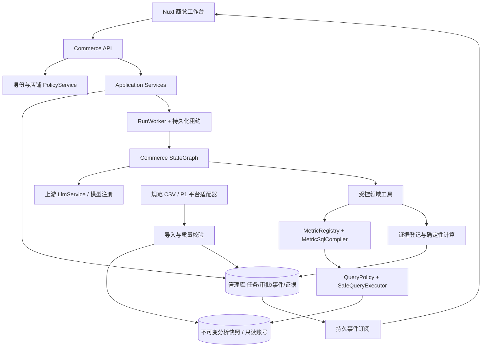

# 04 · 系统架构设计

## 1. 总体选择

采用模块化单体：保留上游 Spring Boot 管理服务，在其内部隔离 Commerce 模块与 RunWorker。首版不拆微服务，不默认部署 Kafka、ClickHouse、Milvus 等非必需组件。API 与 Worker 可以在同一进程，但运行不依赖 HTTP 连接存活，领域数据与事件必须持久化。



## 2. 关键边界

控制面：身份、成员、授权、指标发布、运行调度、规则、报告和审计。数据面：固定快照、受控聚合查询、脱敏结果。模型只接触领域工具接口，不持有 JDBC、管理库连接或秘密。

必须拆开三个数据库身份：管理服务可写管理表；导入服务可写分析 staging/新快照；查询执行器只能 SELECT 已发布快照的分析表/视图。共享 MySQL 实例也不能共用高权限账号。

## 3. 内部接口（目标设计）

```java
record ScopeContext(String tenantId, String subjectId,
    Set<String> storeIds, long authzVersion, String datasetVersionId,
    String metricManifestHash) {}

interface MetricSqlCompiler {
    CompiledQuery compile(QuerySpec spec, ScopeContext scope);
}
interface SafeQueryExecutor {
    QueryResult execute(CompiledQuery query, ScopeContext scope, QueryBudget budget);
}
interface EvidenceRegistry {
    EvidenceRef register(QueryResult result, EvidenceMetadata metadata);
}
interface RunCoordinator {
    RunId submit(CreateRun command, AuthenticatedSubject subject);
    void approve(RunId id, long planVersion, String planHash, long runVersion);
    void cancel(RunId id, long expectedRunVersion);
}
```

这些接口是设计契约，不是声称可以直接编译的完整 Java 实现。执行器再次校验 scope/授权版本，不能信任调用方只在入口检查过一次。

## 4. 一次运行的真实流程

API 验证用户与请求店铺→绑定数据集/指标版本→事务创建运行和事件→Worker 获取租约→计划生成与静态校验→需要时等待审批→每个工具调用前重新鉴权→编译/执行→登记证据→选择下一步→验证报告→持久化结果与完成事件。

断开 SSE 仅断开订阅。Worker 不持有浏览器 sink 作为运行生命线。长连接没有客户端时，仍能完成任务并供之后读取；显式取消才终止任务。

## 5. 不可变快照与复现

每次导入发布新的 `dataset_version_id`。首版采用租户级完整快照，所有 8 张业务表的主键与查询条件包含该版本。发布前数据不可读；发布后不可原地更新。新退款、迟到订单和纠错生成下一版快照。历史报告因此能按同一数据版本重现，不依赖 `MAX(updated_at)` 伪装快照。

复制快照会增加空间成本；首版规模小、以确定性为先。未来可改为版本化分区/不可变增量，但必须保持相同的快照可见性语义。仅在同一数据库事务内的读取一致性不能覆盖长时间诊断和进程重启，因此不把它作为历史复现方案。

## 6. 状态、幂等与并发

运行、步骤、事件、证据使用业务 ID。`run_id != conversation_id != graph_thread_id`；单会话可有多个运行。授权绑定当前身份，不能只凭 threadId 恢复。

Worker 租约包含 owner、expiresAt、fencingToken。抢占/续租通过 DB CAS；过期 Worker 的提交因 fencingToken 不匹配失败。步骤幂等键：`runId + planVersion + actionId + normalizedQueryHash + snapshotId`。成功查询结果先持久化，再登记节点完成；恢复时重复计算可以发生，但持久结果只能接受一次。

不承诺分布式 exactly-once：模型可能在崩溃窗口重复调用并产生额外 Token，但经营查询只读，结果/事件采用幂等提交。重试消耗计入真实预算。

## 7. 缓存与过期

缓存键至少包含 tenantId、授权店铺集合 hash、authzVersion、datasetVersion、metricManifestHash、规范 QuerySpec。缓存只保存有边界的聚合结果，TTL 5min 作为目标配置；不可变快照可延长，但授权读取始终校验。初版可用进程本地缓存，不以 Redis 为强依赖。失效/缓存故障限流直查只读分析库，禁止无界回源。

## 8. 依赖与可观测

沿用上游模型与观测接入，记录 run/node/action 的 trace；不要把隐藏推理或原始隐私数据作为 UI 调试内容。可选外部观测服务失败不得阻塞查询，但本地安全审计失败必须拒绝高风险动作。部署前必须列明哪些 API 会向外部模型发送何种数据。

默认只给模型聚合行和字典说明；按工具限制最大 100 行、每单元格 500 字符。不支持用户级画像或传输手机号/地址。知识检索可降级为固定指标目录，不能绕过口径验证。
