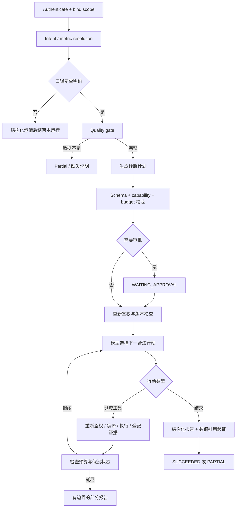

# 06 · Agent 编排、工具与证据驱动诊断

## 1. 设计原则

不是写死“查 GMV→查库存→写总结”。固定的是授权、预算、口径和证据校验；可变化的是模型选择的下一项合法调查。执行图提供循环，模型提交结构化下一步行动，工具结果反过来影响下一步。

默认最大工具调用 12 次、模型总 Token 30,000、活跃执行 180s、结构修复 1 次、模型重试 1 次、单 SQL 3s。所有尝试均计数，不能通过失败重试无限延长预算。等待审批单独 24h TTL。配置是目标值，压测后才能调整上线。

## 2. 目标图与路由

一次澄清结束为 PARTIAL 并给出 `clarification`；用户补充后创建新 run，避免持有不完整 scope 的长期运行。等待审批是唯一需要用户继续原 run 的主要路径。

## 3. 工具注册表

| 工具 | 输入（模型可选） | 输出/限制 |
|---|---|---|
| `resolve_metric` | phrase、candidateMetricIds | 支持的定义/歧义，不执行 SQL |
| `inspect_data_quality` | requiredFacts、dateRange | 覆盖、缺失、水位，不返回原始客户信息 |
| `query_metrics` | 严格 QuerySpec | 已校验聚合值、单位、evidenceId |
| `compare_segments` | metricId、dimension、dateRange | 当前/基线/delta，互斥分组贡献 |
| `decompose_gmv` | 两组已登记的 GMV/orders/AOV 证据 ID | 确定性对称分解及残差校验 |
| `inspect_inventory_signal` | productIds、dateRange | 库存/缺货时长的相关信号；不是因果断言 |
| `lookup_business_definition` | term | 当前租户可见口径/说明知识 |
| `finalize_report` | schema 化报告草案 | 由服务端校验引用/数字，不由模型任意写文件 |

scope、snapshot、指标版本作为服务端隐藏参数注入。工具不能接受原始 SQL、路径、shell、URL、tenantId 或 credentials。库存工具的商品 ID 也必须落在当前授权店铺/数据集内。

## 4. 行动与状态

下一步 JSON 固定 `actionId/toolName/arguments/hypothesisId/expectedEvidenceType`。解释字段仅是一句可审查的调查目的，例如“比较店铺贡献以定位下降集中位置”；不要求输出模型私有思维链。

状态必须包含 runId、conversationId、subjectId、scopeHash、authzVersion、snapshotId、metricManifestHash、planVersion、planHash、acceptedActions、hypotheses、evidenceIds、remainingBudget、steps、runVersion。Node 返回增量状态，证据列表去重，不在上下文重复塞全量 SQL 结果。

## 5. 一个实际诊断例子（合成数据）

输入：“昨天支付 GMV 为什么下降？”

先确认 2026-09-20 相比 2026-09-13；全授权 3 店。GMV 从 600,000 元到 486,200 元，减少 113,800 元。按店拆分发现 s1 减少 105,000 元，s2 减少 10,000 元，s3 增加 1,200 元。s1 占净下降约 92.27%，但这个占比是数学贡献，不是原因概率。

对 s1 分解：订单数 1,440→1,020，客单价 250→250；GMV 的变化全部落在订单数项。会话数均 30,000，订单转化比 4.8%→3.4%。再按 SKU GMV 观察，主力 SKU 减少 99,000 元。若库存数据完整，模型可调用库存工具，发现该 SKU 缺货时长由 30min→480min；结论应写“存在缺货相关信号，建议核查库存与访问分时日志”，不能写“已证实缺货导致损失 99,000 元”。

若库存数据缺失，则分支必须停止库存判断，输出数据不足；若店铺分布完全不同，则不应固定查询 s1。通过这两种扰动实验验证系统确实会按证据调整计划。

## 6. 证据充分性与报告验证

每条 claim 必须有 claimId、type（OBSERVATION / DECOMPOSITION / HYPOTHESIS / LIMITATION / RECOMMENDATION）、text、evidenceRefs。数值主张额外带 `numericBindings`，绑定证据 ID、rowKey、field、transform。transform 只允许已实现的 ID，例如 delta/relativeChange/pp；不能执行模型表达式。

验证器检查：引用存在且授权匹配；数据集/指标版本一致；所有数字由可用字段或确定性计算产生；分组贡献残差在 1 分内；结论不把缺失写为0；截断结果不能称“全部”；未知指标与退款 SKU 拒绝；存在矛盾证据时报告必须显式说明。

可信呈现分为“已验证事实”“数学分解”“相关线索”“待核实建议”。不输出没有校准过的“根因置信度 97%”。规则严重度、证据充分性与模型自评置信度不能混用。

## 7. 审批绑定

计划包含预期工具集合、最大次数、数据范围、日期、预算、计划哈希和版本。批准请求携带 planVersion/planHash/expectedRunVersion；服务端重新检查授权与数据可用性。重新规划使旧批准失效；扩大时间、店铺、工具能力或预算必须形成新版本并重新审批。计划中的允许行动可以动态选择，但不能越过批准边界。

审批基于 DB CAS 提交；两个浏览器同时批准只能有一个有效状态变更。无权审批、过期计划、指标停用、授权变化返回明确状态码，不回退到自动执行。

## 8. 恢复与预算

RunWorker 崩溃后，新 Worker 通过租约恢复。持久结果已存在的工具直接读取，不重复产出证据；模型生成已保存的结构化动作可重用。若模型输出在持久化前丢失，则允许重调用并计费，不能宣称零额外成本。

长时间等待后授权版本变更：受影响运行变为 ACCESS_REVOKED；原范围有任意丢失就不静默缩小分析。用户以新范围创建新运行。SSE重连按 sequence 重放，不触发新规划，不视为任务恢复入口。
